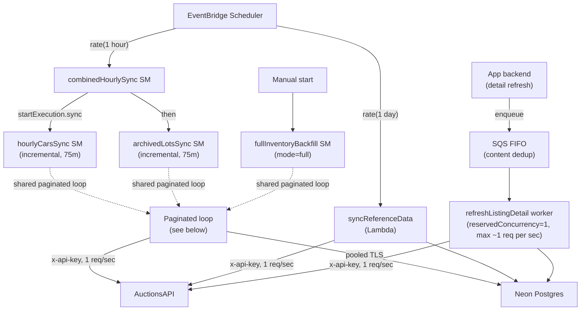
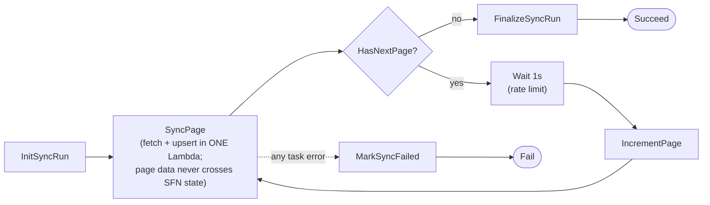

# AuctionsAPI → Neon Ingestion

Production-ready ingestion system that syncs vehicle auction data from
[AuctionsAPI](https://auctionsapi.com/auction-docs) into **Neon Serverless
Postgres**. Our website/backend queries **our own database**, never AuctionsAPI
directly — AuctionsAPI is treated purely as an external supplier sync API.

Built with **Pulumi (TypeScript) + AWS Lambda (Node 20) + Step Functions +
EventBridge Scheduler + Secrets Manager + CloudWatch**.

---

## Contents / project structure

```
.
├── db/                          # Database schema + migrations
│   ├── schema.ts                # Drizzle schema (source of truth for shape + typed queries)
│   ├── migrations/0001_initial.sql   # Plain SQL run in production (migrate.mjs)
│   ├── migrate.mjs              # Tiny idempotent SQL migration runner
│   └── drizzle.config.ts        # Drizzle Kit config (dev-time generation)
│
├── functions/                   # Lambda source (bundled by esbuild before deploy)
│   ├── shared/
│   │   ├── types.ts             # API payload + Lambda<->SFN message types
│   │   ├── auctionsApiClient.ts # HTTP client (x-api-key, retry classification, pagination)
│   │   ├── db.ts                # Neon pool + idempotent upserts
│   │   ├── normalize.ts         # Raw API -> DB row shapes (keeps raw_json)
│   │   ├── pagination.ts        # Loop stop-conditions
│   │   ├── detailRefresh.ts     # Shared fetch+upsert for one listing
│   │   └── syncRun.ts           # sync_runs lifecycle + resume helpers
│   ├── syncCarsPage/handler.ts          # fetch + upsert one /cars page (merged)
│   ├── syncArchivedLotsPage/handler.ts  # fetch + archive one /archived-lots page (merged)
│   ├── syncReferenceData/handler.ts
│   ├── refreshListingDetail/handler.ts  # SQS FIFO drain worker (1 req/sec)
│   ├── syncRunLifecycle/handler.ts   # create / finalize / fail (3 exports)
│   └── build.mjs                # esbuild bundler -> functions/dist/<name>.js
│
├── infra/                       # Pulumi program
│   ├── src/{index,config,iam,secrets,lambdas,queues,step-functions,schedules}.ts
│   ├── Pulumi.yaml
│   ├── Pulumi.dev.yaml.example
│   ├── bootstrap-pulumi-backend.ps1  # one-time: S3 state bucket
│   └── bootstrap-github-oidc.ps1     # one-time: GitHub Actions OIDC role
│
├── scripts/start-backfill.ps1   # manually start the full backfill
└── docs/sample-cars-response.json
```

---

## Architecture



### Paginated loop (shared by backfill, hourly cars, archived lots)



### Ingestion flows

| Flow | Trigger | Endpoint | State machine / Lambda |
|------|---------|----------|------------------------|
| 1. Full inventory backfill | Manual | `/cars` (no minutes, per_page=1000) | `fullInventoryBackfill` |
| 2. Hourly active cars | EventBridge `rate(1 hour)` | `/cars?minutes=75&per_page=1000` | `hourlyCarsSync` (via combined) |
| 3. Hourly archived lots | After cars | `/archived-lots?minutes=75&per_page=1000` | `archivedLotsSync` (via combined) |
| 4. Reference data | Manual + daily | `/manufacturers/cars`, `/models/{id}/cars`, `/generations/{id}/cars` | `syncReferenceData` Lambda |
| 5. Detail refresh | Internal, via SQS FIFO queue | `/search-lot/{lot}/{domain}` or `/search-vin/{vin}` | `refreshListingDetail` worker |

---

## API notes

Field mappings were verified against the live API and documented at the code that
handles them ([auctionsApiClient.ts](functions/shared/auctionsApiClient.ts),
[normalize.ts](functions/shared/normalize.ts), [types.ts](functions/shared/types.ts)).
Two non-obvious behaviours worth knowing before editing those files:

- **Pagination has no `last_page`/`total`** (Laravel `simplePaginate`). The loop
  stops when `links.next` is `null` or the page is empty — never on a page count.
- **`/cars` and `/archived-lots` return different shapes.** `/cars` is a car with
  a nested `lots[]`; `/archived-lots` is flat lot records with `{value}`-wrapped
  prices. They have separate normalizers.

---

## Database

Tables: `cars`, `auction_lots`, `manufacturers`, `vehicle_models`,
`vehicle_generations`, `sync_runs`. Every table stores `raw_json` for future
reprocessing. See [db/schema.ts](db/schema.ts) and
[db/migrations/0001_initial.sql](db/migrations/0001_initial.sql).

**Idempotency / unique keys (all upserts use `ON CONFLICT`):**

- `auction_lots (domain_id, lot_number)` — the reliable lot identity, used for
  both active and archived flows.
- `cars (external_car_id)` — unique when present; NULLs are distinct in Postgres.
- `manufacturers/vehicle_models/vehicle_generations (external_id)`.

**Fallback when `external_car_id` is missing:** we still upsert the **lots**
(keyed on `domain_id + lot_number`) and simply skip the car-row link. We never
rely on VIN alone for identity (VIN can be missing or duplicated); VIN is stored
and indexed for lookup only.

**Archiving never hard-deletes:** `archiveLots` sets `archived = TRUE` +
`archived_at` (preserving the upstream archive time) and updates
status/prices/sale_date.

---

## Prerequisites

- Node 20+, npm
- Pulumi CLI, AWS CLI v2
- An AWS account reachable via **SSO** (`aws sso login`), and a Neon project
- This repo uses the **S3 state backend + passphrase encryption** pattern (same
  as the sibling `ecommerce-store` project), not Pulumi Cloud.

---

## Setup

### 1. Install dependencies

```powershell
npm install                       # root (workspaces: db, functions, infra)
```

### 2. One-time: create the Pulumi S3 state backend

```powershell
$env:AWS_PROFILE = "your-sso-profile"
aws sso login
./infra/bootstrap-pulumi-backend.ps1 -Region eu-central-1 -Profile your-sso-profile
# Then log in to the backend it prints:
pulumi login s3://pulumi-state-<accountId>?region=eu-central-1
```

(Optional, for CI) create the GitHub OIDC deploy role:

```powershell
./infra/bootstrap-github-oidc.ps1 -GitHubOrg <org> -GitHubRepo selectauto -Profile your-sso-profile
```

### 3. Initialize the stack and set config

```powershell
cd infra
cp Pulumi.dev.yaml.example Pulumi.dev.yaml
pulumi stack init dev          # you'll be asked for a PULUMI_CONFIG_PASSPHRASE

# Non-secret config (defaults already in the example file):
pulumi config set aws:region eu-central-1
pulumi config set auctions-ingestion-infra:projectName auctions-ingestion
pulumi config set auctions-ingestion-infra:environment dev
pulumi config set auctions-ingestion-infra:auctionsApiBaseUrl https://auctionsapi.com/api
pulumi config set auctions-ingestion-infra:hourlySyncScheduleExpression "rate(1 hour)"
pulumi config set auctions-ingestion-infra:dailyReferenceSyncScheduleExpression "rate(1 day)"
pulumi config set auctions-ingestion-infra:logRetentionDays 14

# Secrets (encrypted into Pulumi state; pushed to Secrets Manager + Lambda env):
pulumi config set --secret auctions-ingestion-infra:auctionsApiKey  <YOUR_API_KEY>
pulumi config set --secret auctions-ingestion-infra:neonDatabaseUrl <NEON_POOLED_URL>
```

> **Neon URL:** use the **pooled** connection string (host contains `-pooler`),
> with `?sslmode=require`. The pooled endpoint (PgBouncer) is what keeps many
> short-lived Lambda invocations from exhausting Postgres backends.

### 4. Run the database migration

```powershell
$env:NEON_DATABASE_URL = "<NEON_POOLED_URL>"
npm run migrate            # applies db/migrations/*.sql idempotently
```

### 5. Deploy

```powershell
npm run deploy             # = build Lambda bundles, then `pulumi up` in infra/
```

`npm run deploy` runs `functions/build.mjs` (esbuild bundles each handler into
`functions/dist/<name>.js`, with `pg` bundled in) **before** `pulumi up`. Always
build before deploying; `npm run preview` does the same for a dry run.

> **Module systems differ by package (don't "fix" this):** the `functions/` and
> `db/` packages are **ESM** (NodeNext) — internal imports use explicit `.js`
> extensions, and esbuild bundles them. The **`infra/` Pulumi program is
> CommonJS** (`module: CommonJS`) because Pulumi runs it via its bundled ts-node
> in CJS mode — so its internal imports are **extensionless** (`./config`, not
> `./config.js`). Adding `.js` to infra imports breaks `pulumi up` with
> `Cannot find module './config.js'`.

---

## Operating the flows

### Start a full backfill (manual)

```powershell
$env:AWS_PROFILE = "your-sso-profile"
./scripts/start-backfill.ps1                  # from page 1
./scripts/start-backfill.ps1 -StartPage 42    # resume from a checkpoint page
```

This starts the `fullInventoryBackfill` state machine with
`{ flowType:"full_backfill", mode:"full", page:1, perPage:1000 }`. It fetches a
page, upserts cars+lots, waits 1 second, and repeats until `links.next` is null
(or an empty page). Progress is written to `sync_runs`.

### How the hourly sync works

EventBridge Scheduler fires `combinedHourlySync` on `rate(1 hour)`. That machine
runs `hourlyCarsSync` **then** `archivedLotsSync` **sequentially** (never in
parallel — that protects the 1 req/sec budget). Each uses `minutes=75` (not 60)
so delayed records aren't missed, and each upsert is idempotent, so overlapping
windows reprocessing the same records is harmless.

### Reference data

Runs daily via EventBridge (non-forced: it **skips** if manufacturers already
exist). Force a full refresh by invoking the Lambda with `{ "force": true }`:

```powershell
# PowerShell mangles inline JSON quotes for native CLIs — pass via a file.
'{"force":true}' | Out-File -Encoding ascii payload.json
aws lambda invoke --function-name auctions-ingestion-dev-syncReferenceData `
  --payload file://payload.json --cli-binary-format raw-in-base64-out out.json
Remove-Item payload.json
```

### Detail refresh (internal, queued)

On-demand refresh of a SINGLE listing (by lot+domain or VIN). Your app backend
uses this when a detail page is stale/missing, or to pull `prices` history.

**It is NOT invoked directly** — that would let N concurrent users make N
concurrent AuctionsAPI calls and breach the 1 req/sec limit. Instead the backend
**enqueues** a request to the detail-refresh **SQS FIFO queue**, and a single
worker (`reservedConcurrency = 1`) drains it serially at ~1 req/sec. Duplicate
requests for the same listing within ~5 min are deduplicated by the queue.

Get the queue URL from outputs: `pulumi stack output detailRefreshQueueUrl`.

```powershell
$q = pulumi stack output detailRefreshQueueUrl   # run in infra/

# by lot+domain (FIFO requires --message-group-id; dedup is content-based)
aws sqs send-message --queue-url $q `
  --message-group-id auctionsapi `
  --message-body '{"lot":"45289258","domain":"iaai_com"}'

# by VIN
aws sqs send-message --queue-url $q `
  --message-group-id auctionsapi `
  --message-body '{"vin":"WBA3B5G55FNS17722"}'
```

From the backend, send a message to this queue URL with a JSON body matching the
shape above and a fixed `MessageGroupId` (e.g. `auctionsapi`). Tune throughput
vs. the bulk sync via the worker's `DETAIL_REFRESH_PACE_MS` env var. Failed
messages retry up to 5×, then land in the `-detail-refresh-dlq`.

#### When should the backend enqueue a refresh?

The hourly sync already keeps **everything** reasonably fresh (it re-pulls
anything AuctionsAPI changed in the last 75 min). So the backend should enqueue a
refresh only for these **exceptions** — not on every page view:

- **Stale detail page.** On a listing page, if `auction_lots.updated_at` is older
  than a threshold (e.g. 30 min), enqueue `{ lot, domain }` and render the
  current row anyway — the refresh lands in seconds, no need to block the page.
- **Cache miss on search.** A user searches a VIN/lot you don't have yet (brand
  new, or never synced). Enqueue `{ vin }` (or `{ lot, domain }`) so the catalog
  self-heals for listings people actually look for; show a "loading" state and
  re-query shortly after.
- **Price history needed.** The bulk sync stores *current* prices only. The
  `prices` history array comes **only** from the detail endpoints. If a page
  shows a price-over-time chart and the row's `raw_json` has no `prices`, enqueue
  a refresh (worker calls with `prices_history=1`).
- **Looks broken.** A row with a missing image/field from an earlier partial sync
  — an admin "refresh this listing" button enqueues a targeted re-pull.

**Guard against waste.** Enqueueing is cheap, but each message still costs one of
your ~1 req/sec budget. Two rules keep it sane: (1) only enqueue past a staleness
threshold, never unconditionally; (2) the queue already deduplicates identical
requests within ~5 min, so many users hitting the same stale listing cost **one**
API call, not many. Do **not** enqueue on every request "just in case".

---

## Local testing

- **Type-check everything:** `npm run type-check`.
- **Client/normalize against the live API** (no DB writes): bundle a tiny script
  with esbuild importing `functions/shared/*` and run it with
  `AUCTIONS_API_BASE_URL` + `AUCTIONS_API_KEY` set. (This is exactly how the
  field mappings in this repo were verified.)
- **DB upserts locally:** set `NEON_DATABASE_URL` to a dev branch and call the
  `db.ts` functions from a script.
- **State machine logic:** in the AWS console, use *Start execution* on
  `fullInventoryBackfill` with a small `perPage` (e.g. 5) to watch the loop.

---

## Logging & profiling

**Structured JSON logs.** Every Lambda logs single-line JSON via
[functions/shared/logger.ts](functions/shared/logger.ts), and the Lambdas run
with the nodejs20.x **native JSON `LoggingConfig`** (`logFormat: JSON`,
`applicationLogLevel: INFO`). Each line carries correlation context
(`flowType`, `syncRunId`, `page`, `mode`) so you can trace a whole run.

**Per-step timing.** `logger.time(name, fn)` wraps each fetch/upsert/archive
and emits `durationMs`. Example real line:

```json
{"level":"info","msg":"fetch_cars_page","flowType":"hourly_cars","syncRunId":999,"page":1,"perPage":3,"minutes":75,"durationMs":560.78}
```

**Querying (CloudWatch Logs Insights).** Examples:

```
# avg upstream fetch latency per flow
fields @timestamp, durationMs, flowType
| filter msg = "fetch_cars_page"
| stats avg(durationMs), max(durationMs) by flowType

# slow DB upserts
fields @timestamp, durationMs, page, carsIn
| filter msg = "upsert_cars_page" and durationMs > 1000
| sort durationMs desc

# all errors for one run
fields @timestamp, msg, error
| filter syncRunId = 1234 and level = "error"
```

**Durable run history.** The `sync_runs` table is the audit log: status,
pages/records processed, `last_page_processed`, `error_message`, timings. Query
it directly for sync health.

**Step Functions** log executions to CloudWatch at `ERROR` level with execution
data, and the visual graph shows per-state timing in the console.

**Set `LOG_LEVEL=debug`** (Lambda env var) to enable `logger.debug` lines.

> Not included by design (chosen scope): X-Ray tracing, CloudWatch alarms, and a
> dashboard. To add later: set `tracingConfig: { mode: "Active" }` on the Lambdas
> + `tracingConfiguration` on the state machines for X-Ray; add
> `aws.cloudwatch.MetricAlarm` on Lambda `Errors`/`Throttles` and on a custom
> "sync failed" metric.

## Resume / checkpointing

v1 is intentionally simple: every paginated step writes `last_page_processed`,
`pages_processed`, and `records_processed` to the run's `sync_runs` row **after
each page commits**. So `last_page_processed` is always the last page that fully
landed in Neon; the page that failed did not advance it.

To resume a failed backfill, find the checkpoint and start one past it:

```sql
SELECT id, status, last_page_processed, records_processed, error_message
FROM sync_runs WHERE flow_type = 'full_backfill' ORDER BY id DESC LIMIT 1;
```

```powershell
./scripts/start-backfill.ps1 -StartPage <last_page_processed + 1>
```

Because every upsert is idempotent (`ON CONFLICT`), re-running a page that
already committed is harmless — so starting a page or two early to be safe is
fine; the overlap just updates rows.

`functions/shared/syncRun.ts#findResumePoint` returns the latest unfinished run
for a flow, which a future version can use to auto-resume.

**Note on retries vs. failures.** The Step Functions Retry policy only retries
*transient* errors (429, 5xx, Lambda infra). Non-transient failures — e.g. a
Postgres `project size limit exceeded` when Neon storage is full — are NOT
retried; the run is marked `failed` (see `error_message`) and you resume after
fixing the cause (e.g. upgrading the Neon plan).

---

## Tradeoffs & design decisions

**Step Functions instead of one big Lambda.** A full backfill can span thousands
of pages at 1 req/sec — far beyond Lambda's 15-minute limit. Step Functions own
the long-running loop, give native retry/backoff for 429/5xx, make the `Wait 1s`
a first-class state, and surface execution state for debugging. Each Lambda stays
short, stateless, and independently retryable.

**Fetch + upsert in ONE Lambda per page (not two).** A page of 1000 cars with
full `lots`/`images` is several MB. AWS Lambda caps a synchronous response at
6 MB and Step Functions caps state at 256 KB, so returning the page from a
"fetch" Lambda and passing it through state to a separate "upsert" Lambda fails
with `Function.ResponseSizeTooLarge`. The merged `syncCarsPage` /
`syncArchivedLotsPage` Lambdas fetch and write in the same invocation; only small
loop-control fields (page, hasNextPage, counters) ever cross SFN state. This is
the standard fix for the "don't pass bulk payloads through Step Functions"
anti-pattern.

**Page fetching is serialized (no Map/parallel).** The rate limit is 1 req/sec.
A single sequential loop with a `Wait` between fetches is the only way to honor
that across a distributed system; parallel fetches would blow the limit and get
429-throttled. The combined hourly machine also runs cars then archived lots in
series for the same reason.

**Detail refresh goes through an SQS FIFO queue, not a direct invoke.** The
1 req/sec limit is a *global* budget. If the backend invoked the detail Lambda
directly, N concurrent users opening detail pages would make N concurrent
AuctionsAPI calls and breach it (and starve the bulk sync with 429s). Funnelling
through a FIFO queue + a single-concurrency worker makes detail refreshes
strictly serialized and paced, and content-based dedup collapses repeat requests
for the same listing. Users get an eventual (seconds-later) refresh instead of a
synchronous one — the right trade for a freshness fallback. (Strict option for
later: route the bulk flows through the *same* queue so there is literally one
pipe to AuctionsAPI; today they share the budget loosely and may briefly overlap
during a backfill — tune `DETAIL_REFRESH_PACE_MS` to yield.)

**EventBridge for recurring flows.** Schedules are declarative, cheap, and
decoupled from the workflow logic — change `rate(1 hour)` in config without
touching code. Manual flows (backfill) simply have no schedule.

**Neon needs no Lambda VPC.** Neon is a public serverless Postgres reached over
TLS. Putting Lambdas in a VPC just to reach it would add a NAT gateway (cost),
slower cold starts, and ENI limits — all for no benefit. Lambdas use public
egress for both AuctionsAPI and Neon. We use the **pooled** Neon endpoint so
connection counts stay bounded.

**Frontend queries our DB, not AuctionsAPI.** This decouples our UX from supplier
latency/rate limits/outages, lets us index and join freely, keeps the API key
server-side only, and gives us full history via `raw_json`. AuctionsAPI is a sync
source, not a request-time dependency.

**Drizzle for shape, plain SQL for migrations.** Drizzle gives typed queries for
the app, but production DDL is a hand-maintained SQL file run by a tiny
idempotent runner — so deploys don't depend on a migration framework inside
Lambda.

---

## Reference-sync scaling (known limitation)

`syncReferenceData` walks manufacturers → models → generations at 1 req/sec in a
single Lambda. For the full catalog that can exceed the 15-min limit. v1 supports
`{ "maxManufacturers": N }` to bound one invocation; a future version should move
this into its own Step Functions loop (same pattern as the page loops).

---

## Security notes

- The API key and Neon URL live in **AWS Secrets Manager** (created by Pulumi)
  and are also injected as Lambda env vars from Pulumi config secrets. IAM scopes
  secret read access to those specific ARNs.
- **Rotate the AuctionsAPI key** if it was ever shared in plaintext (e.g. in
  chat/CI logs): set a new value with `pulumi config set --secret ...` and
  `pulumi up`.
- Never expose the API key to the frontend.
