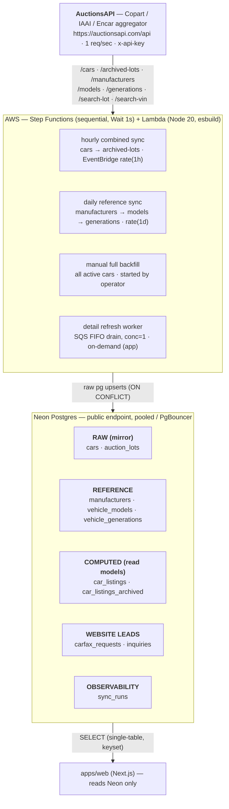

# 00 — Ingestion System Overview

> **Scope of these docs.** Docs `01`–`07` document the **data ingestion +
> infrastructure** half of the repo — how we consume the AuctionsAPI, what we
> store, how we compute our read models, and the AWS infra that runs it.
> [`08-web-all-cars-page.md`](08-web-all-cars-page.md) documents the **`apps/web`
> all-cars catalog** that consumes the read models (the page, filters, and the
> active/past views). Deeper web design records live in `apps/web/CLAUDE.md`,
> `apps/web/ALL-CARS-PLAN.md`, `apps/web/ALL-CARS-DB-DESIGN.md`.

## What this system is

`selectauto.bg` is a vehicle-import business: cars from **Korea (ENCAR)** and
**USA / Canada (Copart + IAAI)** auctions. The ingestion system keeps a **Neon
Postgres** database continuously synchronized with vehicle auction data pulled
from a third-party aggregator, **AuctionsAPI** (`https://auctionsapi.com/api`),
which itself aggregates Copart, IAAI and Encar.

The website reads **only** from Neon. It never calls AuctionsAPI directly (with
one rate-limited exception — on-demand detail refresh, see
[04-ingestion-flows.md](04-ingestion-flows.md)). All upstream traffic goes
through the ingestion system so the **1 request/second** rate limit is honored
globally.

## The two questions these docs answer

1. **What are we consuming, how, and why?** → [01-auctionsapi-consumption.md](01-auctionsapi-consumption.md)
2. **What tables do we store and compute, and why?** → [02-data-model-and-tables.md](02-data-model-and-tables.md) and [05-projection-tables-car-listings.md](05-projection-tables-car-listings.md)

## High-level data flow

## The three kinds of tables (why each exists)

| Kind | Tables | Populated by | Purpose |
|------|--------|--------------|---------|
| **Raw mirror** | `cars`, `auction_lots` | hourly cars sync, full backfill, detail refresh, archived sync | A faithful, idempotent mirror of upstream vehicle + lot data. Every row keeps `raw_json` so new columns can be backfilled without re-pulling from the API. |
| **Reference** | `manufacturers`, `vehicle_models`, `vehicle_generations` | daily reference sync | Brand/model/generation lookup tables. `cars` stores only external numeric ids (`manufacturer_id` etc.); names are resolved through these. |
| **Computed read models** | `car_listings`, `car_listings_archived` | recompute functions called from every write path | Pre-joined, pre-deduped, pre-computed **one-row-per-physical-car** projections that the website paginates single-table with zero joins. The expensive per-car collapse (`GROUP BY car_id`) times out on the ~1M-row live set, so it is materialized incrementally at write time. See [05](05-projection-tables-car-listings.md). |
| **Website leads** | `carfax_requests`, `inquiries` | the website backend (not ingestion) | Low-volume form submissions. Documented here only for completeness of the schema. |
| **Observability** | `sync_runs` | every sync flow | One row per sync execution: status, pages, records, errors, checkpoint. |

## Key design facts (carried throughout these docs)

- **Rate limit = 1 req/sec, enforced globally.** Not per-Lambda. The Step
  Functions `WaitOneSecond` state paces page loops; the detail-refresh worker has
  `reservedConcurrency = 1` + a trailing sleep. See [04](04-ingestion-flows.md).
- **Pagination is Laravel `simplePaginate`** — there is **no** `total` /
  `last_page`. The next-page signal is `links.next` (URL or `null`). See [01](01-auctionsapi-consumption.md).
- **A page's data never leaves its Lambda.** A page of 1000 cars with lots/images
  exceeds Lambda's 6 MB response limit and Step Functions' 256 KB state limit, so
  fetch **and** write happen in one invocation; only small counters cross the
  state machine. See [04](04-ingestion-flows.md).
- **Lot identity = `(domain_id, lot_number)`.** Reliable even when external
  ids / VIN are missing or duplicated. This is the upsert conflict key.
- **A car can have many lots (1 → N).** ~94% have one lot; tens of thousands have
  2–14 (relisted / withdrawn, sometimes across Copart + IAAI). `cars` = the
  physical vehicle; `auction_lots` = each listing. The read models collapse this
  back to one card per car. See [05](05-projection-tables-car-listings.md).
- **Never assume a field exists.** Normalization guards every access; missing →
  `null`. See [03](03-normalization-and-field-mapping.md).

## Where things live in the repo

| Path | What |
|------|------|
| `packages/functions/shared/` | API client, normalizers, DB layer, logger, pagination — the ingestion core |
| `packages/functions/<name>/handler.ts` | One Lambda handler per sync flow |
| `packages/functions/build.mjs` | esbuild bundler (one ESM file per handler) |
| `packages/db/schema.ts` | Drizzle schema (source of truth for table SHAPE + typed queries) |
| `packages/db/migrations/*.sql` | Plain-SQL migrations (what actually runs in prod) |
| `packages/db/migrate.mjs` | Minimal append-only migration runner |
| `packages/db/backfill-car-listings.mjs` | One-time projection backfill script |
| `packages/db/backfill-car-listings.mjs` | Projection backfill / drift-repair (both read models, via `--fn`) |
| `infra/src/` | Pulumi TS — Lambdas, Step Functions, schedules, IAM, secrets, SQS |
| `apps/web/` | Next.js frontend (reads Neon). The all-cars catalog → [08](08-web-all-cars-page.md). |
| `docs/` | These docs + `sample-cars-response.json` (a real `/api/cars` record) |

## Reading order

1. [01-auctionsapi-consumption.md](01-auctionsapi-consumption.md) — the upstream contract
2. [02-data-model-and-tables.md](02-data-model-and-tables.md) — what we store
3. [03-normalization-and-field-mapping.md](03-normalization-and-field-mapping.md) — raw → rows
4. [04-ingestion-flows.md](04-ingestion-flows.md) — how data moves (the 5 write paths)
5. [05-projection-tables-car-listings.md](05-projection-tables-car-listings.md) — what we compute
6. [06-infrastructure-aws-pulumi.md](06-infrastructure-aws-pulumi.md) — the AWS/Pulumi layer
7. [07-operations-runbook.md](07-operations-runbook.md) — build, deploy, migrate, troubleshoot
8. [08-web-all-cars-page.md](08-web-all-cars-page.md) — the website catalog that consumes the read models
