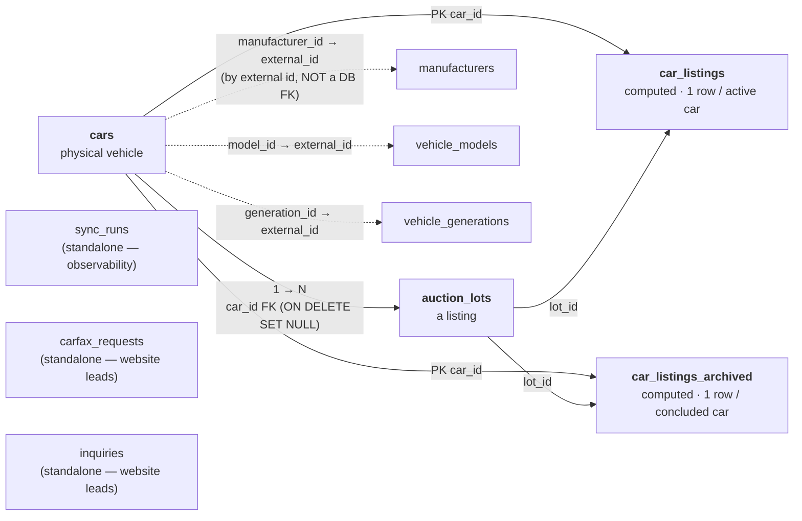

# 02 — Data Model & Tables

This is the reference for **every table we store**, what each column means, and
**why** each non-obvious type/index decision was made. The computed read models
(`car_listings`, `car_listings_archived`) get their own deep-dive in
[05-projection-tables-car-listings.md](05-projection-tables-car-listings.md);
this doc gives their shape, that doc gives their logic.

**Two sources of truth, kept in sync:**

- [`packages/db/schema.ts`](../packages/db/schema.ts) — Drizzle schema. Source of
  truth for table **shape** and the typed queries the website uses.
- [`packages/db/migrations/*.sql`](../packages/db/migrations/) — **plain SQL** is
  what actually runs in production (no Drizzle migration runner ships in Lambda).

Conventions across all ingestion tables:
- `id SERIAL PRIMARY KEY` — local surrogate key.
- `external_*` columns hold **AuctionsAPI** ids, which are **not** our local PKs.
- `raw_json JSONB` keeps the **entire** upstream payload, so new columns can be
  backfilled later without re-pulling from the API.
- `created_at` / `updated_at TIMESTAMPTZ` default `now()`; `updated_at` is set on
  every upsert.

---

## Entity relationships

> Solid arrows = real Postgres foreign keys. Dashed arrows = **logical** joins via
> `*_external_id`, **not** DB foreign keys — `cars` stores the API's
> manufacturer/model/generation ids and they're matched against the reference
> tables' `external_id` unique indexes.

---

## `cars` — one row per distinct vehicle

The AuctionsAPI `/api/cars` record **is** the car; its nested `lots[]` is split
into `auction_lots`. Holds intrinsic vehicle attributes (title, year, brand,
model, color, engine, transmission, drive, VIN).

| Column | Type | Notes |
|---|---|---|
| `id` | `SERIAL` PK | local id |
| `external_car_id` | `BIGINT` | AuctionsAPI car `id`. Best stable car key we have. **Upsert conflict target.** |
| `vin` | `TEXT` | |
| `title` | `TEXT` | e.g. `"2015 BMW 328I xDrive"` |
| `year` | `INTEGER` | |
| `manufacturer_id` | `BIGINT` | AuctionsAPI **external** id → `manufacturers.external_id` |
| `model_id` | `BIGINT` | external id → `vehicle_models.external_id` |
| `generation_id` | `BIGINT` | external id → `vehicle_generations.external_id` |
| `body_type` | `TEXT` | enum `.name` (e.g. `sedan`) — car sub-shape |
| `vehicle_type` | `TEXT` | enum `.name` (automobile/truck/boat/moto/…) — top category. Added migration 0013; backfilled from `raw_json` for existing rows. |
| `color` | `TEXT` | enum `.name` |
| `fuel_type` | `TEXT` | from upstream `fuel.name` (field renamed) |
| `transmission` | `TEXT` | enum `.name` |
| `drive_wheel` | `TEXT` | enum `.name` (front/all/rear) |
| `engine` | `TEXT` | `engine.name` (human string; `engine.id` only in raw_json) |
| `raw_json` | `JSONB` | full upstream car object |
| `created_at`, `updated_at` | `TIMESTAMPTZ` | |

**Indexes**
- `cars_external_car_id_ux` — **unique** on `external_car_id`. Postgres treats
  NULLs as distinct, so cars without an external id are still insertable (the
  fallback path) and de-duped by their lots' `(domain_id, lot_number)` instead.
- `cars_vin_idx` — on `vin`.

---

## `auction_lots` — one row per lot listing

One row per auction listing. **Identity = `(domain_id, lot_number)`** — reliable
even when external ids / VIN are missing or duplicated, which is why it's the
upsert key rather than `external_lot_id`.

| Column | Type | Notes |
|---|---|---|
| `id` | `SERIAL` PK | local id; also the `sort_id` used by the read models |
| `external_lot_id` | `BIGINT` | AuctionsAPI lot `id` |
| `car_id` | `INTEGER` FK → `cars.id` | `ON DELETE SET NULL`. The local link to the physical car. |
| `lot_number` | `TEXT NOT NULL` | part of the unique key |
| `domain_id` | `INTEGER NOT NULL` | part of the unique key. 1=IAAI, 3=Copart, 12=Encar |
| `domain_name` | `TEXT` | e.g. `iaai_com` → website source badge |
| `status` | `TEXT` | enum `.name` (sale/sold/upcoming/...) |
| `sale_date` | `TIMESTAMPTZ` | auction date (present on only ~14% of active lots) |
| `odometer_km` | `BIGINT` | **BIGINT, not INTEGER** — see below |
| `bid_price` | `NUMERIC(14,4)` | **NUMERIC, not BIGINT** — see below |
| `buy_now_price` | `NUMERIC(14,4)` | |
| `final_bid` | `NUMERIC(14,4)` | |
| `buy_now` | `BOOLEAN` | derived: `true` when buy-now price > 0 |
| `condition` | `TEXT` | enum `.name` |
| `damage_main` | `TEXT` | `damage.main.name` (free text; ~2,393 distinct) |
| `seller` | `TEXT` | `seller.name` |
| `location_country` | `TEXT` | → website **market** tab (USA/Canada/kr) |
| `location_state` | `TEXT` | |
| `location_city` | `TEXT` | |
| `image_url` | `TEXT` | one image (prefer CDN `downloaded[0]`, else `normal[0]`) |
| `archived` | `BOOLEAN NOT NULL DEFAULT FALSE` | sold/withdrawn flag from upstream |
| `archived_at` | `TIMESTAMPTZ` | upstream archive time when present |
| `raw_json` | `JSONB` | full upstream lot object (also the TOAST bulk — see note) |
| `created_at`, `updated_at` | `TIMESTAMPTZ` | |

**Indexes**
- `auction_lots_domain_lot_ux` — **unique** `(domain_id, lot_number)`. Backs the
  upsert.
- `auction_lots_car_id_idx`, `auction_lots_status_idx`, `auction_lots_archived_idx`.

### Why `odometer_km` is BIGINT (migration 0002)
AuctionsAPI sometimes returns odometer values **above the INT max**
(2,147,483,647) — garbage/sentinel readings like `2553571660` — which overflow a
plain `integer` column ("value out of range for type integer"). `BIGINT` absorbs
them. `sync_runs.records_processed` was widened to BIGINT in the same migration.

### Why prices are NUMERIC(14,4) (migration 0003)
AuctionsAPI sends **fractional** prices (confirmed live: `15530.14`, even
`51928.1213`), which a `BIGINT` column rejects ("invalid input syntax for type
bigint"). `NUMERIC(14,4)` stores exact decimals — unlike `float`, which would
round money imprecisely. precision 14 / scale 4 covers any vehicle price without
truncation. (Drizzle returns NUMERIC as a **string** in selects — correct for
money; the raw-`pg` ingestion path passes JS numbers, which serialize into
NUMERIC fine.)

### Storage note (raw_json / TOAST)
On the live DB `auction_lots` measured ~5.9 GB, but **~88.5% of that is TOAST =
`raw_json`**. The real heap is only ~555 MB. This matters for the read-model
storage analysis in [05](05-projection-tables-car-listings.md) — the projection
tables do **not** copy `raw_json`.

---

## Reference tables

`cars` stores only external numeric ids; these three tables resolve them to
names. Populated by the **daily reference sync** ([04](04-ingestion-flows.md)).
Each has a `*_external_id_ux` unique index backing its upsert.

### `manufacturers` — from `/api/manufacturers/cars`
| Column | Type | Notes |
|---|---|---|
| `id` | `SERIAL` PK | |
| `external_id` | `BIGINT NOT NULL` | AuctionsAPI manufacturer id (**unique**) |
| `name` | `TEXT` | e.g. `BMW` |
| `image_url` | `TEXT` | brand logo SVG |
| `cars_qty` | `INTEGER` | upstream count; used to skip empty brands |
| `raw_json` | `JSONB` | |

### `vehicle_models` — from `/api/models/{manufacturer_id}/cars`
| Column | Type | Notes |
|---|---|---|
| `external_id` | `BIGINT NOT NULL` | model id (**unique**) |
| `manufacturer_external_id` | `BIGINT` | parent brand (indexed) |
| `name` | `TEXT` | e.g. `3er` |
| `image_url` | `TEXT` | always NULL (models endpoint has no image; kept for symmetry) |
| `cars_qty` | `INTEGER` | |
| `raw_json` | `JSONB` | |

### `vehicle_generations` — from `/api/generations/{model_id}/cars`
| Column | Type | Notes |
|---|---|---|
| `external_id` | `BIGINT NOT NULL` | generation id (**unique**) |
| `model_external_id` | `BIGINT` | parent model (indexed) |
| `name` | `TEXT` | e.g. `V (E60/E61)` |
| `from_year`, `to_year` | `INTEGER` | generation production span |
| `raw_json` | `JSONB` | |

> **Why the read models don't denormalize brand/model names:** the daily
> reference sync can rename a manufacturer/model **without touching any lot**, so
> a per-lot recompute hook would miss the change. The projections store only the
> ids; names are resolved at read time. See [05](05-projection-tables-car-listings.md).

---

## `sync_runs` — observability / checkpointing

One row per sync execution. Written at start, updated per page, finalized at end.

| Column | Type | Notes |
|---|---|---|
| `id` | `SERIAL` PK | the `syncRunId` threaded through the state machine |
| `flow_type` | `TEXT NOT NULL` | `full_backfill` \| `hourly_cars` \| `archived_lots` \| `reference` \| `detail_refresh` |
| `status` | `TEXT NOT NULL` | `running` \| `succeeded` \| `failed` |
| `started_at` | `TIMESTAMPTZ` | |
| `finished_at` | `TIMESTAMPTZ` | set when finished |
| `pages_processed` | `INTEGER` | |
| `last_page_processed` | `INTEGER` | **checkpoint** for resume (see [07](07-operations-runbook.md)) |
| `records_processed` | `BIGINT` | accumulated lot/record count (BIGINT — long backfills) |
| `error_message` | `TEXT` | failure cause (truncated to 4000 chars) |
| `metadata_json` | `JSONB` | run params (mode, perPage, minutes, startPage) |

**Index:** `sync_runs_flow_status_idx` on `(flow_type, status)` — used by
`findResumePoint()` to locate the latest unfinished run for a flow.

---

## `car_listings` — computed read model (active catalog)

ONE row per physical car that **currently has ≥1 active, image-bearing lot**.
Pre-joined + pre-deduped + pre-computed projection of `(cars + its chosen
auction_lots row)`. The website paginates this **single-table, zero joins, no
query-time DISTINCT**. Logic, pick-strategy, and maintenance →
[05](05-projection-tables-car-listings.md).

Shape (migrations 0006 table + 0009 adds `engine` + 0014 adds `vehicle_type`/`body_type`; indexes in 0008):

| Group | Columns |
|---|---|
| identity | `car_id` PK (→cars), `lot_id` (→auction_lots, the lot that won the collapse) |
| filters | `manufacturer_id`, `model_id`, `car_year`, `car_color`, `drive_wheel`, `vehicle_type`, `body_type`, `buy_now`, `domain_name`, `location_country`, `lot_number`, `vin`, `effective_price` |
| sort | `sort_id INTEGER NOT NULL` = chosen lot id (keyset cursor + newest-first) |
| display | `title`, `engine`, `image_url`, `odometer_km`, `sale_date`, `status`, `condition`, `damage_main`, `seller`, `transmission`, `buy_now_price`, `bid_price`, `final_bid` |
| meta | `updated_at` |

`effective_price = COALESCE(NULLIF(buy_now_price,0), NULLIF(final_bid,0), NULLIF(bid_price,0))`.

**Indexes (0008):** `cl_sort` + composites each leading with a filter column and
ending in `sort_id DESC` (`cl_brand_sort`, `cl_brand_model_sort`, `cl_buynow_sort`,
`cl_year_sort`, `cl_color_sort`, `cl_country_sort`), a partial `cl_price_sort
WHERE effective_price > 0`, plus `cl_lotnumber` (text_pattern_ops) and `cl_vin`.
`drive_wheel` (3 values) / `transmission` (2) are too low-selectivity to index —
they filter in-scan.

---

## `car_listings_archived` — computed read model (past / sold)

Sibling of `car_listings` for **concluded** lots — one row per physical car whose
chosen archived lot is `sold`/`not_sold`/`failed` **and** which has no active
image lot (the two tables are kept **disjoint**: a car is active XOR past). Powers
the "Приключили" (past) toggle for price research. Same shape as `car_listings`
(includes `engine`, and `vehicle_type`/`body_type` via 0014). Migrations 0010
(table + fn), 0011 (indexes), 0012 (concluded-only fix), 0014 (adds the type
columns to both projections + redefines both recompute fns). Indexes mirror 0008
with a `cla_` prefix.

For the membership rule, pick-strategy (most-recent-result), and the
concluded-only fix history, see [05](05-projection-tables-car-listings.md).

---

## Website-lead tables (not ingestion)

These are written by the **website backend**, not the ingestion system. They are
low-volume, have **no** `raw_json` and **no** upsert keys (every submission is a
row). Documented here only so the full schema is in one place.

### `carfax_requests` — Carfax check form (`/carfax` page)
Ported from WordPress `wp_sa_carfax_requests`.
`id`, `full_name*`, `phone*`, `email`, `vin*`, `car_make`, `car_model`,
`message`, `page_url`, `user_ip`, `created_at`. Indexes on `created_at` and `vin`.
(`*` = NOT NULL.)

### `inquiries` — "Безплатна консултация" lead modal
The multi-step quiz from the old theme footer.
`id`, `name*`, `phone*`, `specific_model`, `brand`, `model`, `budget`, `time`,
`finance`, `page_url`, `user_ip`, `created_at`. Index on `created_at`. Only
name + phone are required (the quiz branch is skippable).

---

## Migration history (what each `.sql` did)

Run in lexical order by [`migrate.mjs`](../packages/db/migrate.mjs); applied files
tracked in `_migrations`. All use `IF NOT EXISTS` / `CREATE OR REPLACE`, so
re-runs are safe.

| File | What it does |
|---|---|
| `0001_initial.sql` | Creates `cars`, `auction_lots`, `manufacturers`, `vehicle_models`, `vehicle_generations`, `sync_runs` + their indexes. |
| `0002_widen_integer_columns.sql` | `auction_lots.odometer_km` and `sync_runs.records_processed` → `BIGINT` (overflow fix). `lock_timeout 5s`. |
| `0003_prices_to_numeric.sql` | `auction_lots` price columns `BIGINT` → `NUMERIC(14,4)` (fractional prices). One combined `ALTER` (single rewrite); `statement_timeout 0` for the ~1M-row rewrite. |
| `0004_carfax_requests.sql` | `carfax_requests` table. |
| `0005_inquiries.sql` | `inquiries` table. |
| `0006_car_listings.sql` | `car_listings` **table only** (indexes deferred to 0008). |
| `0007_recompute_car_listings.sql` | `recompute_car_listings(int[])` function — the active read model's single source of truth. |
| `0008_car_listings_indexes.sql` | All `car_listings` indexes (created post-backfill) + `ANALYZE`. |
| `0009_car_listings_engine.sql` | Adds `car_listings.engine` + redefines the recompute fn to populate it. |
| `0010_car_listings_archived.sql` | `car_listings_archived` table + `recompute_archived_car_listings(int[])`. |
| `0011_car_listings_archived_indexes.sql` | `car_listings_archived` indexes + `ANALYZE`. |
| `0012_archived_concluded_only.sql` | Tightens archived membership to `sold/not_sold/failed`; purges non-concluded rows. |
| `0013_cars_vehicle_type.sql` | Adds `cars.vehicle_type` (the API top-level category — boats/trucks/moto/…). Backfilled from `raw_json` (no API; see [03](03-normalization-and-field-mapping.md)). |
| `0014_listings_vehicle_body_type.sql` | Adds `vehicle_type` + `body_type` to **both** projections + redefines both recompute fns to populate them (powers the website "Тип" filter). |

> Migrations are **append-only and hand-run** (`pnpm migrate`). They are **not**
> applied automatically on deploy. See [07-operations-runbook.md](07-operations-runbook.md).
