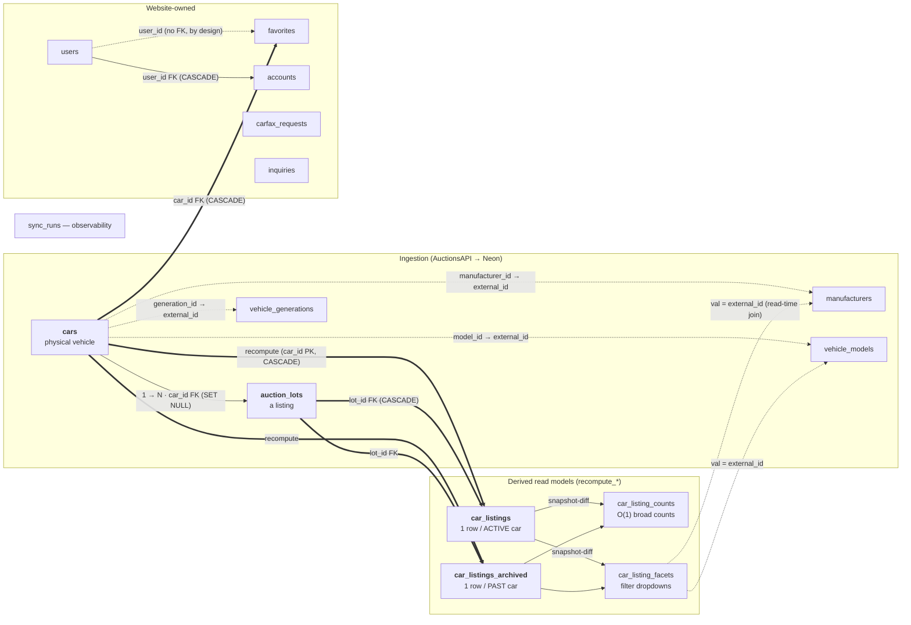

# 02 — Data Model & Tables

The reference for **every table we store**: its purpose, how it is **populated**,
what it **connects to**, who **reads** it, and **why** each non-obvious
type/index/constraint decision was made. Computed read models (`car_listings`,
`car_listings_archived`) and the maintenance functions get a deep-dive in
[05-projection-tables-car-listings.md](05-projection-tables-car-listings.md); the
ingestion flows that drive the writes are in
[04-ingestion-flows.md](04-ingestion-flows.md). This doc gives the **shapes,
relationships, and population model**.

**Sources of truth (kept in sync by hand):**

- [`packages/db/schema.ts`](../packages/db/schema.ts) — Drizzle schema. Source of
  truth for table **shape** and the typed queries the website uses.
- [`packages/db/migrations/*.sql`](../packages/db/migrations/) — **plain SQL** is
  what actually runs in production (no Drizzle migration runner ships in Lambda),
  applied by [`migrate.mjs`](../packages/db/migrate.mjs) and tracked in
  `_migrations`.
- **The live database itself** — since migration 0024, every terse/EAV/footgun
  column carries a `COMMENT ON COLUMN`. View them with `\d+ <table>` in psql,
  Drizzle Studio (`pnpm --filter @auctions-ingestion/db db:studio`), or
  `col_description()`. If this doc and the DB ever disagree, the DB wins — treat
  that as drift to fix (a `drizzle-kit`/`\d` snapshot check in CI is on the wish
  list; see [Cross-cutting invariants](#cross-cutting-invariants--gotchas)).

**Conventions across the ingestion tables:**
- `id SERIAL PRIMARY KEY` — local surrogate key. **Not** the AuctionsAPI id.
- `external_*` / `*_external_id` columns hold **AuctionsAPI** ids and are matched
  against the reference tables' `external_id` unique indexes — they are **not** DB
  foreign keys (see the [external-id footgun](#cross-cutting-invariants--gotchas)).
- `raw_json JSONB` keeps the **entire** upstream payload so new columns can be
  backfilled later without re-pulling from the API.
- `created_at` / `updated_at TIMESTAMPTZ DEFAULT now()`; `updated_at` is bumped on
  every upsert.

---

## Table catalog

Row counts are approximate (Postgres `reltuples`, except the two projections which
were measured 2026-07-11). 18 tables in four functional groups + operational + auth.

| Table | ~Rows | Group | Populated by | Primary key |
|---|---:|---|---|---|
| `cars` | 1.39 M | Ingestion base | `upsertCarsAndLots` (Flows 1/2/5) | `id` |
| `auction_lots` | 1.49 M | Ingestion base | `upsertCarsAndLots` + `archiveLots` (Flow 3) | `id` |
| `manufacturers` | 424 | Reference | `syncReferenceData` (Flow 4) | `id` |
| `vehicle_models` | 3 462 | Reference | `syncReferenceData` (Flow 4) | `id` |
| `vehicle_generations` | 5 012 | Reference | `syncReferenceData` (Flow 4) | `id` |
| `car_listings` | 932 k | Projection (active) | `recompute_car_listings(_counted)` | `car_id` |
| `car_listings_archived` | 399 k | Projection (past) | `recompute_archived_car_listings(_counted)` | `car_id` |
| `car_listing_counts` | 28 | Summary | `apply_listing_count_delta` (snapshot-diff) | `(table_kind,dim,val)` |
| `car_listing_facets` | 3 925 | Summary | `apply_listing_facet_delta` (snapshot-diff) | `(table_kind,dim,val,val2)` |
| `sync_runs` | ~890 | Operational | `createSyncRun` / `updateSyncRun` | `id` |
| `_migrations` | ~25 | Operational | `migrate.mjs` | `filename` |
| `carfax_requests` | low | Website lead | carfax route mutation (write-only) | `id` |
| `inquiries` | low | Website lead | `createInquiry` action (write-only) | `id` |
| `users` | low | Auth | Auth.js adapter + credentials sign-up | `id` |
| `accounts` | low | Auth | Auth.js adapter (Google OAuth link) | `(provider,provider_account_id)` |
| `verification_tokens` | low | Auth | email-verification flow | `(identifier,token)` |
| `password_reset_tokens` | low | Auth | forgot-password flow | `token` |
| `favorites` | low | User data | favourite toggle mutation | `(user_id,car_id)` |

---

## Entity map

```mermaid
flowchart LR
  subgraph ingest["Ingestion (AuctionsAPI → Neon)"]
    cars["<b>cars</b><br/>physical vehicle"]
    lots["<b>auction_lots</b><br/>a listing"]
    mfg["manufacturers"]
    mod["vehicle_models"]
    gen["vehicle_generations"]
  end
  subgraph derived["Derived read models (recompute_*)"]
    cl["<b>car_listings</b><br/>1 row / ACTIVE car"]
    cla["<b>car_listings_archived</b><br/>1 row / PAST car"]
    clc["car_listing_counts<br/>O(1) broad counts"]
    clf["car_listing_facets<br/>filter dropdowns"]
  end
  subgraph site["Website-owned"]
    fav["favorites"]
    usr["users"]
    acc["accounts"]
    cfx["carfax_requests"]
    inq["inquiries"]
  end
  sr["sync_runs — observability"]

  cars -->|"1 → N · car_id FK (SET NULL)"| lots
  cars -.->|"manufacturer_id → external_id"| mfg
  cars -.->|"model_id → external_id"| mod
  cars -.->|"generation_id → external_id"| gen
  cars ==>|"recompute (car_id PK, CASCADE)"| cl
  lots ==>|"lot_id FK (CASCADE)"| cl
  cars ==>|"recompute"| cla
  lots ==>|"lot_id FK"| cla
  cl -->|"snapshot-diff"| clc
  cl -->|"snapshot-diff"| clf
  cla --> clc
  cla --> clf
  clf -.->|"val = external_id (read-time join)"| mfg
  clf -.->|"val = external_id"| mod
  cars ==>|"car_id FK (CASCADE)"| fav
  usr -.->|"user_id (no FK, by design)"| fav
  usr -->|"user_id FK (CASCADE)"| acc
```

> `==>`/solid = **real Postgres foreign keys**. `-.->`/dashed = **logical** joins
> via `*_external_id` (matched to the reference tables' `external_id` unique index)
> or app-layer links (`favorites.user_id`), **not** DB foreign keys.

---

# A. Ingestion base tables

## `cars` — one row per distinct vehicle
The AuctionsAPI `/api/cars` record **is** the car; its nested `lots[]` is split
into `auction_lots`. Holds intrinsic, stable vehicle attributes.

- **Populated by** `upsertCarsAndLots` (Flows 1 full-backfill / 2 hourly-cars / 5
  detail-refresh), `INSERT … ON CONFLICT (external_car_id) DO UPDATE`. Attributes
  are mapped from the raw payload in
  [`shared/normalize.ts`](../packages/functions/shared/normalize.ts).
- **Read by** the recompute functions (the projection's `JOIN cars`), the
  `/avtomobil/[id]` detail page, and `favorites` (stable car identity).
- **Connections** — `1 → N` to `auction_lots` (`auction_lots.car_id` FK, `ON
  DELETE SET NULL`); parent of both projections (`car_id` PK, `ON DELETE CASCADE`);
  `manufacturer_id`/`model_id`/`generation_id` are **external ids** → the reference
  tables' `external_id` (logical, not FK).

| Column | Type | Null | Meaning |
|---|---|---|---|
| `id` | serial | NN | local PK |
| `external_car_id` | bigint | | AuctionsAPI car id. **Upsert conflict target.** UNIQUE, but NULLs are distinct (fallback path) → not a guaranteed dedupe key. |
| `vin` | text | | indexed (`cars_vin_idx`) |
| `title` | text | | e.g. `"2015 BMW 328I xDrive"` |
| `year` | integer | | |
| `manufacturer_id` | bigint | | **EXTERNAL** id → `manufacturers.external_id` (NOT `.id`) |
| `model_id` | bigint | | **EXTERNAL** id → `vehicle_models.external_id` |
| `generation_id` | bigint | | **EXTERNAL** id → `vehicle_generations.external_id` |
| `body_type` | text | | car sub-shape (`sedan`/`suv`/…), `body.name` |
| `vehicle_type` | text | | top category (`automobile`/`truck`/`boat`/`moto`/…). Added 0013, backfilled from `raw_json`. |
| `color` | text | | `color.name` |
| `fuel_type` | text | | Upstream **drivetrain** tag: `electric` includes many HEV/PHEV, `hybrid` is separate → **not** a clean BEV filter. Denormalized to both projections (0020). |
| `transmission` | text | | `transmission.name` |
| `drive_wheel` | text | | front/all/rear |
| `engine` | text | | `engine.name` |
| `raw_json` | jsonb | | full upstream car object |
| `created_at` / `updated_at` | timestamptz | NN | |

**Indexes** — `cars_external_car_id_ux` (UNIQUE, backs the upsert; NULLs distinct →
fallback inserts allowed), `cars_vin_idx`.

## `auction_lots` — one row per lot listing
One row per auction listing. **Identity = `(domain_id, lot_number)`** — reliable
even when external ids/VIN are missing, so it is the upsert key (not
`external_lot_id`). A car has `1 → N` lots (~94% have exactly one).

- **Populated by** `upsertCarsAndLots` (active feed, Flows 1/2/5) and `archiveLots`
  (archived feed, Flow 3), both `INSERT … ON CONFLICT (domain_id, lot_number) DO
  UPDATE`. `archiveLots` sets `archived=TRUE` and never hard-deletes.
- **Read by** the recompute functions (which pick the "best" lot per car) and the
  detail-refresh path.
- **Connections** — `car_id` FK → `cars.id` (`ON DELETE SET NULL`); `id` is
  referenced by both projections' `lot_id` FK (`ON DELETE CASCADE`) and is the
  value copied into `sort_id`.

| Column | Type | Null | Meaning |
|---|---|---|---|
| `id` | serial | NN | local PK; also the projections' `lot_id`/`sort_id` |
| `external_lot_id` | bigint | | AuctionsAPI lot id |
| `car_id` | integer | | FK → `cars.id` (SET NULL). The local link to the physical car. |
| `lot_number` | text | NN | half of the natural key |
| `domain_id` | integer | NN | **Auction source-site id** (1=IAAI, 3=Copart, 12=Encar), NOT a DNS host. Half of the natural key. |
| `domain_name` | text | | source-site name (copart/iaai/encar) → source badge |
| `status` | text | | `sale`/`sold`/`upcoming`/`not_sold`/… (`.name`) |
| `sale_date` | timestamptz | | auction date (present on only ~14% of active lots) |
| `odometer_km` | bigint | | **BIGINT** — see note |
| `bid_price` / `buy_now_price` / `final_bid` | numeric(14,4) | | **NUMERIC** — see note |
| `buy_now` | boolean | | **DERIVED** in `normalize.ts` (buy-now price > 0), not raw. Real rule: `buy_now=true AND effective_price>0`. |
| `condition` | text | | `.name` |
| `damage_main` | text | | primary damage (`damage.main.name`; ~2.4k distinct). No secondary-damage column. |
| `seller` | text | | `seller.name` |
| `location_country` | text | | → website **market** tab (USA/Canada/kr) |
| `location_state` / `location_city` | text | | |
| `image_url` | text | | one image (prefer CDN `downloaded[0]`, else `normal[0]`) |
| `archived` | boolean | NN | sold/withdrawn flag from upstream (default `false`) |
| `archived_at` | timestamptz | | upstream archive time when present |
| `raw_json` | jsonb | | full upstream lot (the TOAST bulk — see note) |
| `created_at` / `updated_at` | timestamptz | NN | |

**Indexes** — `auction_lots_domain_lot_ux` (UNIQUE, backs the upsert),
`auction_lots_car_id_idx`, `auction_lots_status_idx`, `auction_lots_archived_idx`.

- **Why `odometer_km` is BIGINT (0002):** AuctionsAPI returns sentinel odometers
  above INT-max (e.g. `2553571660`) that overflow `integer`. (`sync_runs.records_processed`
  was widened in the same migration.)
- **Why prices are NUMERIC(14,4) (0003):** upstream sends fractional prices
  (`15530.14`, `51928.1213`) that a `bigint` rejects; `numeric` stores exact money
  (no float rounding). Drizzle returns NUMERIC as a **string** in selects.
- **Storage note:** on the live DB `auction_lots` is ~5.9 GB but **~88.5% is TOAST =
  `raw_json`**; the real heap is ~555 MB. The projections deliberately do **not**
  copy `raw_json`.

---

# B. Reference tables

`cars` stores only external numeric ids; these three resolve them to names.
Populated by the **daily reference sync** (Flow 4, `syncReferenceData`), each
`INSERT … ON CONFLICT (external_id) DO UPDATE`. **Read at query time** to turn
facet ids into display names (`getCarFacets`, `getCarBrands`, the brand/model hub
+ sitemap queries). They are intentionally **not** joined into the projections at
write time (see the [names-vs-ids invariant](#cross-cutting-invariants--gotchas)).

### `manufacturers` — `/api/manufacturers/cars`
`id` (PK), `external_id` (bigint NN, **UNIQUE** — the join key), `name` (e.g.
`BMW`), `image_url` (brand logo SVG), `cars_qty` (upstream count, used to skip
empty brands), `raw_json`, timestamps. Index: `manufacturers_external_id_ux`.

### `vehicle_models` — `/api/models/{manufacturer_id}/cars`
`external_id` (UNIQUE), `manufacturer_external_id` (parent brand, indexed
`vehicle_models_manufacturer_idx`), `name` (`3er`), `image_url` (always NULL —
endpoint has none), `cars_qty`, `raw_json`.

### `vehicle_generations` — `/api/generations/{model_id}/cars`
`external_id` (UNIQUE), `model_external_id` (parent model, indexed
`vehicle_generations_model_idx`), `name` (`V (E60/E61)`), `from_year`/`to_year`,
`raw_json`.

---

# C. Projection read models

Two hand-maintained tables that collapse the `cars → auction_lots` 1:N into
**exactly one card per physical car** and denormalize the attributes the catalog
filters/sorts on, so `/vsichki-avtomobili` queries them **single-table, zero
joins, no query-time DISTINCT**. They are **plain tables, not materialized views**
(a full `REFRESH`'s `GROUP BY car_id` collapse times out on live Neon), maintained
incrementally by SQL functions. The two are kept **strictly disjoint** — a car is
active **XOR** past — so every write path refreshes both. Pick-strategy, membership
rules, and history live in [05](05-projection-tables-car-listings.md); this is the
shape.

Both share an identical column set (except `car_listings_archived.archived_at`):

| Group | Columns |
|---|---|
| identity | `car_id` PK (FK→cars, CASCADE), `lot_id` (FK→auction_lots, CASCADE — the lot that won the collapse) |
| filters | `manufacturer_id`, `model_id` (external ids), `car_year`, `car_color`, `drive_wheel`, `vehicle_type`, `body_type`, `fuel_type`, `buy_now`, `domain_name`, `location_country`, `lot_number`, `vin`, `effective_price` |
| sort | `sort_id` (int NN) = chosen lot id → keyset cursor **and** newest-first sort key |
| display | `title`, `engine`, `image_url`, `odometer_km`, `sale_date`, `status`, `condition`, `damage_main`, `seller`, `transmission`, `buy_now_price`, `bid_price`, `final_bid` |
| meta | `updated_at`; **archived only:** `archived_at` (set-once, 0023) |

- **`effective_price`** is derived and its **precedence differs by table**:
  active = `COALESCE(NULLIF(buy_now_price,0), NULLIF(final_bid,0), NULLIF(bid_price,0))`;
  archived = `final_bid` **first** (the realized sold price). Always NULL-or-positive
  (never literally 0) — which is why the channel predicate can treat `price>0` as
  `price IS NOT NULL`.
- **`manufacturer_id`/`model_id`** are the **external** ids copied from `cars` (same
  read-time-join footgun as on `cars`). Brand/model **names are never stored**.

### `car_listings` — active catalog (~932 k rows)
One row per physical car with **≥1 non-archived, image-bearing lot**.
- **Populated by** `recompute_car_listings(int[])` (pick-strategy) wrapped by
  `recompute_car_listings_counted(int[])`, called at the end of `upsertCarsAndLots`
  / `archiveLots` for the touched car ids, by the weekly drift sweep, and by
  `backfill-car-listings.mjs`.
- **Read by** `getCarsPage`/`getCarsWindow`/`getPrevCarsPage` (keyset feed on
  `sort_id DESC`), `getCarsCount` (live COUNT for narrow filters), and the
  lot/VIN search.
- **Indexes (0008/0015/0021):** `cl_sort` + one composite per filterable column
  each ending `sort_id DESC` — `cl_brand_sort`, `cl_brand_model_sort`,
  `cl_buynow_sort`, `cl_year_sort`, `cl_color_sort`, `cl_country_sort`,
  `cl_vehicletype_sort`, `cl_bodytype_sort`, `cl_fuel_sort` — plus the partial
  `cl_price_sort … WHERE effective_price > 0`, `cl_lotnumber` (`text_pattern_ops`)
  and `cl_vin`. (`drive_wheel`/`transmission` are too low-selectivity — filtered
  in-scan.)

### `car_listings_archived` — past / sold (~399 k rows)
One row per physical car whose chosen **concluded** lot is `sold`/`not_sold`/`failed`
and which has **no** active image lot. Powers the "Приключили" toggle for
auction-result/price browsing.
- **Populated by** `recompute_archived_car_listings(int[])` wrapped by
  `recompute_archived_car_listings_counted(int[])` (same call sites).
- **Read by** the same catalog queries with `status=past`, and by
  [`proxy.ts`](../apps/web/src/proxy.ts) which uses `archived_at` for the SEO
  "410 Gone" policy on long-dead lots.
- **Extra column** `archived_at` (0023): set-once on first insert, **preserved** on
  conflict (unlike `updated_at`, bumped every recompute) → a true "how long
  archived" signal. Indexed `cla_archived_at`. Other indexes mirror `car_listings`
  with a `cla_` prefix.

---

# D. Summary tables

Two tiny **derived-from-the-projection** tables that make the catalog header and
filter dropdowns O(1)/index-scan instead of full scans. Both use a deliberate
**generic EAV shape** (`table_kind, dim, val[, val2], n`) so one table serves every
broad count / every dropdown. Both are maintained **incrementally** by the same
`recompute_*_counted` wrappers that maintain the projections — a **before/after
snapshot-diff in the same transaction** (PgBouncer-safe, no temp tables), so they
never drift under normal operation. Column meanings are pinned by `COMMENT ON
COLUMN` + `CHECK` constraints (0024). If they ever drift (a race / a swallowed
apply), re-derive with [`reseed-summaries.mjs`](../packages/db/reseed-summaries.mjs)
(`--check` reports drift & negative `n`).

### `car_listing_counts` — exact broad-view counts (0016) · 28 rows
PK `(table_kind, dim, val)` + `n bigint`.

| Column | Domain | Meaning |
|---|---|---|
| `table_kind` | `active`\|`past` | which projection (CHECK) |
| `dim` | `total`\|`country`\|`channel`\|`country+channel` | broad dimension (CHECK), bucketed by `listing_count_keys()` |
| `val` | `''` / `USA`,`kr`,`Canada` / `buy-now`,`auction` / `USA\|auction` | the dimension value |
| `n` | bigint | exact precomputed count |

`getCarsCount → getBroadCount` reads this (O(1) PK lookup) for page-tab views
(market × channel × active/past) instead of a ~750 k-row `COUNT(*)`. Any **narrow**
filter (brand/model/year/price/color/drive/fuel/condition/type/auction-window)
falls back to a live single-table `COUNT`.

### `car_listing_facets` — filter-dropdown options (0017, +`fuel` 0020) · ~3.9 k rows
PK `(table_kind, dim, val, val2)` + `n bigint`, index `(table_kind, dim)`.

| Column | Domain | Meaning |
|---|---|---|
| `table_kind` | `active`\|`past` | site reads only `active` (CHECK) |
| `dim` | `brand`,`model`,`color`,`drive`,`condition`,`year`,`vtype`,`btype`,`fuel` | facet dimension (CHECK), bucketed by `listing_facet_keys()` |
| `val` | id-as-text (brand/model) or raw string | the facet value |
| `val2` | parent **brand** external id for `dim='model'`, else `''` | groups models by brand (part of PK → `''` default is load-bearing) |
| `n` | bigint | rows in this bucket (dropdown counts) |

`getCarFacets` fires one cheap index scan per dimension (~40 ms) instead of 8
GROUP-BY/DISTINCT passes over the ~932 k-row projection (~3 s). **Brand/model NAMES
are intentionally absent** — the daily reference sync renames without touching a
lot, so a denormalized name would go stale; the app resolves `val` (external id) →
name at read time via an `INNER JOIN` to `manufacturers`/`vehicle_models` (which
also drops any nameless id). `getBrandModelHubs` and the sitemap hub queries read
`dim='model'`/`'brand'` too.

---

# E. The maintenance machinery (SQL functions)

Ten functions in `public` implement the projection + summary maintenance. Bare
`recompute_*` are the pick-strategy source of truth; the `_counted` wrappers add
the summary snapshot-diff. **Ingestion and the backfill call only the `_counted`
wrappers** (default), so projections + counts + facets all stay consistent in one
transaction per wrapper.

| Function | Role | Defined/last-changed |
|---|---|---|
| `recompute_car_listings(int[])` | Rebuild the ACTIVE projection for a batch of car ids (UPSERT chosen lot + DELETE orphans). Pick-strategy SoT. | 0007→0009→0014→0020→**0022** |
| `recompute_archived_car_listings(int[])` | Rebuild the PAST projection (concluded lots only, no active-lot cars). | 0010→0012→0014→0020→0022→**0023** |
| `recompute_car_listings_counted(int[])` | Wrapper: advisory-lock → snapshot → `recompute_car_listings` → snapshot → apply count **and** facet deltas (active). | 0016→0017→**0026** |
| `recompute_archived_car_listings_counted(int[])` | Same wrapper for the past table. | 0016→0017→**0026** |
| `listing_count_keys(country,buy_now,price)` | Pure IMMUTABLE mapper: a projection row → its `(dim,val)` count keys. Channel = `buy_now AND price>0`. | 0016 |
| `listing_count_snapshot(table_kind,int[])` | Batch cars' count-key contribution as a `{key→count}` JSONB map (PK-bounded, no seq scan). | 0016 |
| `apply_listing_count_delta(table_kind,before,after)` | Upsert `after−before` non-zero deltas into `car_listing_counts` (`n = n + Δ`). | 0016 |
| `listing_facet_keys(9 args incl. fuel)` | Pure mapper → `(dim,val,val2)` facet keys; year clamped `[1980,2027]`; `btype` only for `vehicle_type='automobile'`. | 0017→**0020** |
| `listing_facet_snapshot(table_kind,int[])` | Batch cars' facet-key contribution as JSONB. | 0017→**0020** |
| `apply_listing_facet_delta(table_kind,before,after)` | Upsert facet deltas into `car_listing_facets`. | 0017 |

**Why snapshot-diff** (not triggers, not re-aggregation): a car can be recomputed
many times, change dimension, move active⇄past, or drop out. Diffing only the
batch's before/after contribution is exact, idempotent (unchanged batch ⇒ Δ0), and
order-independent — and avoids the full-table recount that would reintroduce the
seq scan. The diff's one hazard — a concurrent recompute of the same cars reading a
stale `before` — is closed by the advisory lock (`0026`) that serializes the
wrappers, keeping the efficient set-based diff (no per-row triggers) while making
drift impossible. Full detail in
[05](05-projection-tables-car-listings.md) §"How counts & facets stay in sync".

---

# F. Operational tables

## `sync_runs` — observability / checkpointing (~890 rows)
One row per sync execution; written at start, updated per page, finalized at end.
- **Populated by** `createSyncRun` / `updateSyncRun`
  ([`shared/db.ts`](../packages/functions/shared/db.ts)) from every flow handler.
- **Read by** `findResumePoint()` (latest unfinished run per flow) and ops.

| Column | Type | Meaning |
|---|---|---|
| `id` | serial PK | the `syncRunId` threaded through the state machine |
| `flow_type` | text NN | `full_backfill`\|`hourly_cars`\|`archived_lots`\|`reference`\|`detail_refresh`\|`drift_sweep` (CHECK, 0024; = `shared/types.ts` `FlowType`) |
| `status` | text NN | `running`\|`succeeded`\|`failed` |
| `started_at`/`finished_at` | timestamptz | |
| `pages_processed` | int NN | |
| `last_page_processed` | int NN | **checkpoint cursor, OVERLOADED per flow**: page number / manufacturers-processed index / `cars.id` keyset cursor |
| `records_processed` | bigint NN | accumulated (BIGINT — long backfills) |
| `error_message` | text | failure cause |
| `metadata_json` | jsonb | per-run params (mode/perPage/minutes/…); shape varies by flow |

Index `sync_runs_flow_status_idx` on `(flow_type, status)`.

## `_migrations` — applied-migration ledger
`filename TEXT PK`, `applied_at TIMESTAMPTZ`. Written by
[`migrate.mjs`](../packages/db/migrate.mjs) after each `*.sql` applies (in lexical
order). Migrations are append-only + hand-run; they are **not** applied on deploy.

---

# G. Website-lead tables (not ingestion)

Written by the **website backend**, low-volume, **no** `raw_json`/upsert keys
(every submission is a row), write-only (no in-app reader).

## `carfax_requests` — Carfax check form (`/carfax`)
Ported from WordPress `wp_sa_carfax_requests`. `id`, `full_name*`, `phone*`,
`email`, `vin*`, `car_make`, `car_model`, `message`, `page_url`, `user_ip`,
`created_at`. Indexes on `created_at` and `vin`. (`*` = NOT NULL.) Written by the
carfax route mutation.

## `inquiries` — "Безплатна консултация" lead modal
The multi-step quiz from the old theme footer; written by the `createInquiry`
server action ([`mutations/inquiries`](../apps/web/src/mutations/inquiries/create-inquiry.mutation.ts)).
Only `name`+`phone` are required (the quiz branch is skippable).

| Column | Type | Meaning |
|---|---|---|
| `id` | serial PK | |
| `name*` / `phone*` | text NN | required |
| `specific_model` | text | free-text alternative to brand+model |
| `brand` / `model` | text | quiz answers |
| `budget_range` | text | budget quiz answer. **Renamed from `budget` (0025).** |
| `purchase_timeframe` | text | timeframe quiz answer. **Renamed from `time` (0025)** — it is NOT a timestamp. |
| `financing_option` | text | financing quiz answer. **Renamed from `finance` (0025).** |
| `page_url` / `user_ip` | text | capture context |
| `created_at` | timestamptz NN | indexed |

> The zod schema, the modal form, and the notification email keep the client-side
> field names (`budget`/`time`/`finance`); the mutation maps them onto the renamed
> DB columns. See `0025_rename_inquiries_columns.sql`.

---

# H. Auth & user data

Self-hosted **Auth.js (NextAuth v5)** — Google OAuth + email/password (Credentials),
**JWT sessions** (so there is **no** `sessions` table). Table shapes match
`@auth/drizzle-adapter`; created by `0019_auth.sql`. Keep in sync with schema.ts.
The application-layer flows (sign-in/up, verification, reset, sessions) are in
[09-web-authentication.md](09-web-authentication.md).

- **`users`** — `id TEXT PK` (adapter-generated uuid), `name`, `email* `, `email_verified`,
  `image`, `password_hash` (our addition — bcrypt for Credentials; NULL for
  OAuth-only users), `created_at`. **`users_email_ux` UNIQUE on `lower(email)`**
  (one email = one user, case-insensitive).
- **`accounts`** — OAuth provider links (Google). PK `(provider, provider_account_id)`,
  `user_id` FK → users (CASCADE), plus the adapter's snake_case token columns
  (`refresh_token`/`access_token`/`expires_at`/`token_type`/`scope`/`id_token`/`session_state`).
  Index `accounts_user_id_idx`. **`type`/`identifier` names are adapter-locked — do
  not rename.**
- **`verification_tokens`** — email-verification for new email/password sign-ups.
  PK `(identifier, token)`, `expires`. (`identifier` = email, adapter-locked.)
- **`password_reset_tokens`** — our own forgot-password flow (single-use, expiring).
  `token PK`, `user_id` FK → users (CASCADE), `expires`, `created_at`. Index
  `password_reset_tokens_user_idx`.

## `favorites` — saved cars (user × car set)
One row per (Auth.js user, physical car). PK `(user_id, car_id)` (idempotent toggle
= set membership). `car_id` FK → `cars.id` (**CASCADE** — survives relisting/archival
because it keys the stable car, not a lot). `user_id` is an Auth.js user id with
**no FK by design** (avoids adapter-timing coupling; user-delete cleanup is
app-layer). Index `favorites_user_idx (user_id, created_at DESC)`.
- **Populated by** the favourite toggle mutation; **read by** the `/lyubimi` page
  and the catalog's heart-state id-set lookup. Application-layer wiring (the toggle,
  the context, `/lyubimi`) is documented in
  [10-web-favorites.md](10-web-favorites.md).
- **History:** created by `0018` keyed on the previous auth provider's user id;
  `0019` **dropped and recreated** it with `user_id` when auth moved to Auth.js.

---

## Cross-cutting invariants & gotchas

1. **External ids are not FKs.** `cars.*_id` and the projections'
   `manufacturer_id`/`model_id` hold **AuctionsAPI external ids**; join them to the
   reference tables' `external_id` (the reference tables' own `id` is a *different*
   local serial). Joining on `.id` returns silently-wrong rows. (The DB column
   comments spell this out.)
2. **Names resolve at read time, never denormalized.** Flow 4 can rename a
   brand/model without touching any lot, so the projections/facets store only ids;
   the app joins ids→names when rendering.
3. **The two projections are disjoint** (active XOR past). Every write path calls
   **both** `_counted` wrappers so a car moves cleanly between them.
4. **`effective_price` precedence differs by table** (buy-now-first active vs
   final-bid-first archived) and is never literally 0 → the channel predicate uses
   `price>0`.
5. **Summaries are correct by construction.** The `_counted` wrappers serialize all
   summary maintenance under a transaction-scoped advisory lock (`0026`), so the
   snapshot-diff can't race a concurrent recompute of the same cars and the counters
   can't drift from the projections. A full `reseed-summaries.mjs` is therefore
   needed **only** after a deliberate `recompute_*` **logic change** (e.g. `0022`) —
   never on a timer / "just in case". `reseed-summaries.mjs --check` stays as a cheap
   drift / negative-`n` assertion for CI.
6. **Predicate coupling.** The channel rule (`buy_now AND price>0`) and the year
   clamp `[1980,2027]` are duplicated between the SQL key-helpers and the web
   queries (`get-cars-count`/`get-car-facets`); change them together.
7. **Renames on this shared Neon DB are deploy-coupled.** A column rename breaks any
   running app writing the old name until it redeploys (e.g. the `0025` inquiries
   rename shipped with its web edits).
8. **Never `CREATE OR REPLACE` a function from an old base.** `0020` rebuilt the
   recompute fns from the 0009/0010 bodies + fuel and silently reverted 0012 +
   0014; `0022` fixed it. Base function redefinitions on the *current* body.

---

## Migration history

Run in lexical order by [`migrate.mjs`](../packages/db/migrate.mjs); tracked in
`_migrations`; all use `IF NOT EXISTS`/`CREATE OR REPLACE`/guards so re-runs are
safe. **Append-only and hand-run** (`pnpm migrate`) — not applied on deploy.

| File | What it does |
|---|---|
| `0001_initial.sql` | `cars`, `auction_lots`, `manufacturers`, `vehicle_models`, `vehicle_generations`, `sync_runs` + indexes. |
| `0002_widen_integer_columns.sql` | `auction_lots.odometer_km` + `sync_runs.records_processed` → BIGINT (overflow). |
| `0003_prices_to_numeric.sql` | `auction_lots` prices BIGINT → NUMERIC(14,4) (fractional prices). |
| `0004_carfax_requests.sql` | `carfax_requests` table. |
| `0005_inquiries.sql` | `inquiries` table (original `budget`/`time`/`finance` cols). |
| `0006_car_listings.sql` | `car_listings` table only (indexes deferred). |
| `0007_recompute_car_listings.sql` | `recompute_car_listings(int[])` — active projection SoT. |
| `0008_car_listings_indexes.sql` | All `car_listings` indexes (post-backfill) + ANALYZE. |
| `0009_car_listings_engine.sql` | Adds `car_listings.engine`; redefines the recompute fn. |
| `0010_car_listings_archived.sql` | `car_listings_archived` + `recompute_archived_car_listings(int[])`. |
| `0011_car_listings_archived_indexes.sql` | Archived indexes + ANALYZE. |
| `0012_archived_concluded_only.sql` | Tightens archived membership to `sold/not_sold/failed`; purges non-concluded. |
| `0013_cars_vehicle_type.sql` | Adds `cars.vehicle_type` (top category); backfilled from `raw_json`. |
| `0014_listings_vehicle_body_type.sql` | Adds `vehicle_type`+`body_type` to **both** projections; redefines both recompute fns (powers the "Тип" filter). |
| `0015_type_count_indexes.sql` | `vehicle_type`/`body_type` lead-column indexes (`+ sort_id DESC`) on both projections. |
| `0016_listing_counts.sql` | `car_listing_counts` + snapshot-diff machinery (`listing_count_keys/snapshot`, `apply_listing_count_delta`) + the `recompute_*_counted` wrappers. |
| `0017_listing_facets.sql` | `car_listing_facets` + facet snapshot-diff helpers; **folds** facet maintenance into the `_counted` wrappers. |
| `0018_favorites.sql` | `favorites` — ORIGINAL, keyed on `clerk_user_id` (superseded by 0019). |
| `0019_auth.sql` | Auth.js `users`/`accounts`/`verification_tokens` + our `password_reset_tokens`; `users_email_ux (lower(email))`; **drops & recreates `favorites`** keyed on `user_id`. |
| `0020_listing_fuel_type.sql` | Adds `fuel_type` to both projections + a `'fuel'` facet dim; redefines recompute + `listing_facet_keys/snapshot`. ⚠ Also silently reverted 0012+0014 (fixed by 0022). |
| `0021_fuel_type_indexes.sql` | `cl_fuel_sort` / `cla_fuel_sort` keyset indexes. |
| `0022_recompute_restore_type_columns.sql` | **FIX:** restores `vehicle_type`/`body_type` + the archived concluded-only filter that 0020 dropped (union of 0014+0012+0020). Function-only → followed by a backfill of both tables. |
| `0023_archived_at.sql` | Adds `car_listings_archived.archived_at` (set-once, for the SEO 410 policy); rebases the archived recompute on 0022 + `archived_at` stamping; `cla_archived_at` index; inline backfill. |
| `0024_column_docs_and_checks.sql` | `COMMENT ON COLUMN` for the cryptic/EAV/external-id columns + CHECK constraints on `car_listing_counts`/`car_listing_facets` (`dim`,`table_kind`) and `sync_runs.flow_type`. |
| `0025_rename_inquiries_columns.sql` | Renames `inquiries` `budget`→`budget_range`, `time`→`purchase_timeframe`, `finance`→`financing_option` (+ comments); ships with the schema.ts/mutation edits. |
| `0026_serialize_summary_maintenance.sql` | Wraps both `recompute_*_counted` wrappers in a transaction-scoped `pg_advisory_xact_lock` so concurrent summary maintenance (a bulk backfill/sweep overlapping live ingestion) can't race the snapshot-diff → summaries are correct **by construction**, no periodic reseed. |

> Operational procedures (backfill, reseed, drift sweep, resume) →
> [07-operations-runbook.md](07-operations-runbook.md).
