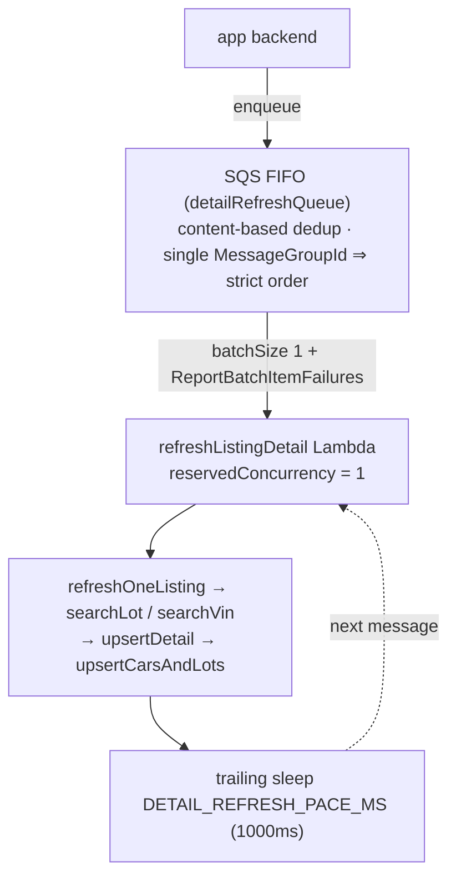
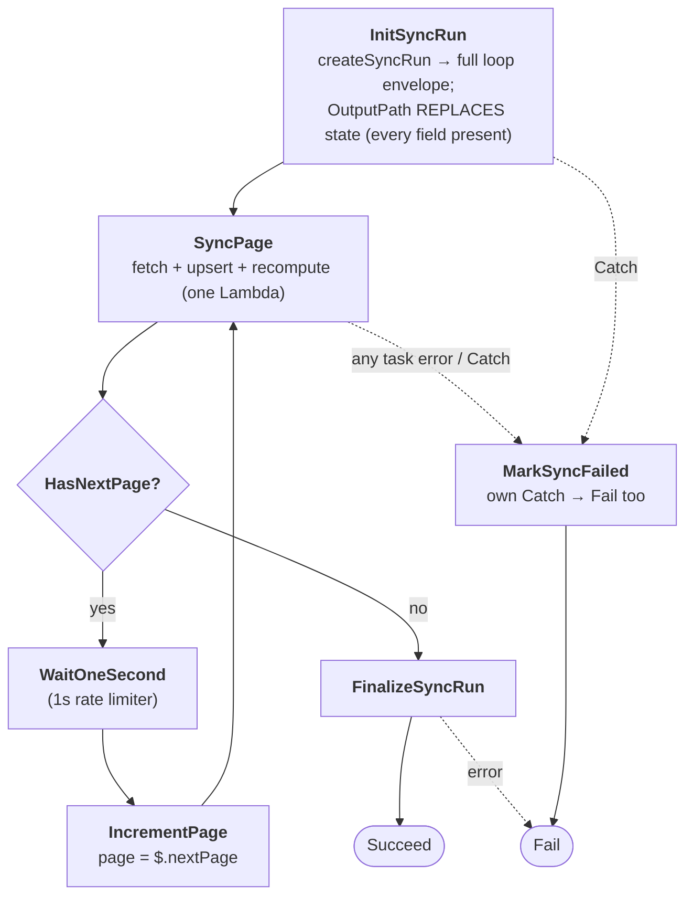
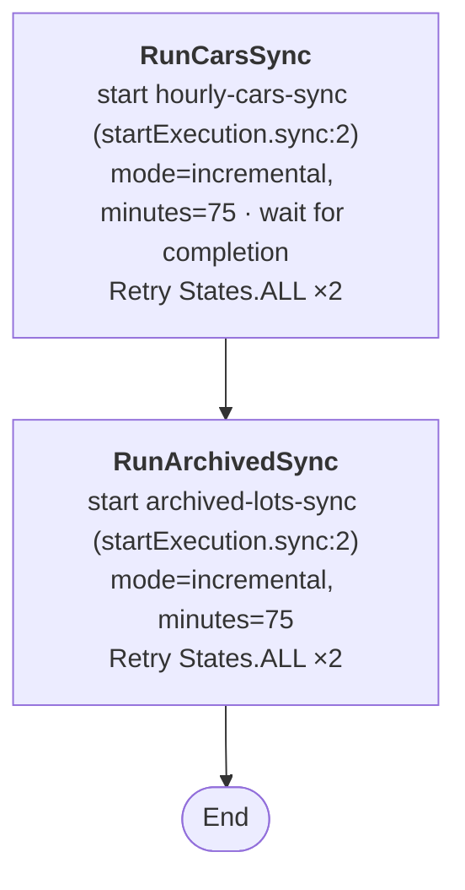
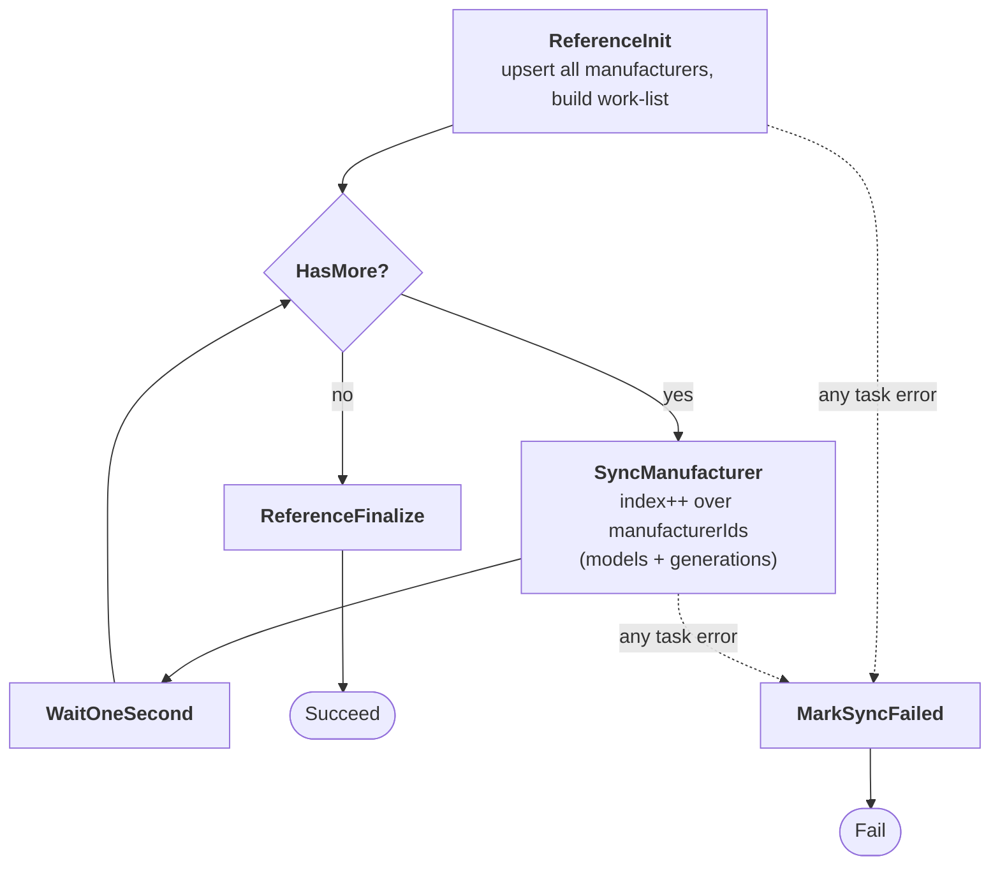

# 04 — Ingestion Flows (The 5 Write Paths)

Every byte that lands in Neon arrives through one of **five write paths**, and all
five funnel through just **two DB write functions** in
[`shared/db.ts`](../packages/functions/shared/db.ts):

- `upsertCarsAndLots(cars[])` — writes `cars` + `auction_lots`, then recomputes
  the read models.
- `archiveLots(lots[])` — marks lots archived/sold, then recomputes the read
  models.

This funnel is what makes the computed read models ([05](05-projection-tables-car-listings.md))
stay correct no matter how data arrives.

| # | Flow | Trigger | Endpoint | DB function | Mode |
|---|------|---------|----------|-------------|------|
| 1 | **Full inventory backfill** | manual (operator starts SFN) | `/cars` (no minutes) | `upsertCarsAndLots` | `full` |
| 2 | **Hourly active cars sync** | EventBridge `rate(1 hour)` | `/cars?minutes=75` | `upsertCarsAndLots` | `incremental` |
| 3 | **Hourly archived lots sync** | (same hourly machine, after #2) | `/archived-lots?minutes=75` | `archiveLots` | `incremental` |
| 4 | **Reference data sync** | EventBridge `rate(1 day)` | `/manufacturers` → `/models` → `/generations` | `upsertManufacturer/Model/Generation` | — |
| 5 | **Detail refresh** | on-demand (app → SQS) | `/search-lot` or `/search-vin` | `upsertDetail` → `upsertCarsAndLots` | — |

Flows **1, 2, 5** call `upsertCarsAndLots`; **3** calls `archiveLots`; **4** uses
the reference upserts. So the recompute hook (read-model maintenance) is exercised
by 1/2/3/5 automatically.

---

## The two cross-cutting invariants

### Invariant A — a page's data never crosses Step Functions state
A page of 1000 cars (with lots + images) exceeds **Lambda's 6 MB response limit**
and **Step Functions' 256 KB state limit**. So each page Lambda **fetches AND
writes in the same invocation** and returns only small loop-control fields +
counters (`SyncPageOutput`). This replaced an earlier split design
(`fetchCarsPage` → `upsertCarsPage`) that failed with
`Function.ResponseSizeTooLarge`.

### Invariant B — 1 req/sec, enforced by the orchestrator
The client never throttles. Pacing is structural:
- page loops insert a `Wait 1s` state between fetches;
- the combined hourly machine runs cars **then** archived sequentially;
- the reference flow sleeps 1s between calls;
- the detail worker is single-concurrency + trailing sleep.

---

## Flow 1 & 2 — Cars sync (full backfill / hourly incremental)

Same Lambda ([`syncCarsPage/handler.ts`](../packages/functions/syncCarsPage/handler.ts)),
same state machine shape; only `mode` + `minutes` differ.

**Per-invocation steps:**
1. `client.getCarsPage({ page, perPage, minutes })` — `minutes` only in
   `incremental` mode (full backfill omits it).
2. `decideNextStep(page)` — compute `hasNextPage` (+ hard stop on empty data).
3. `upsertCarsAndLots(page.data)` — write the page; **data stays in this Lambda**.
4. `updateSyncRun(...)` — bump pages/records/checkpoint.
5. Return `SyncPageOutput` (counters + `hasNextPage` + `nextPage`).

**`upsertCarsAndLots` internals** (one pooled client, per-row loop):
- For each car with a non-null `external_car_id`: upsert `cars`
  `ON CONFLICT (external_car_id) DO UPDATE`, `RETURNING id`.
- For each of its lots with a valid `(domain_id, lot_number)`: upsert
  `auction_lots` `ON CONFLICT (domain_id, lot_number) DO UPDATE`.
  - `car_id = COALESCE(EXCLUDED.car_id, auction_lots.car_id)` — never unlinks.
  - `archived` honors the payload but keeps existing state when absent (see
    [03](03-normalization-and-field-mapping.md#the-archived-handling-why-its-nullable-here)).
- Collect every touched `car_id`, then call **once** (set-based) at end:
  `recompute_car_listings(ids[])` **and** `recompute_archived_car_listings(ids[])`.

> Lots missing `(domain_id, lot_number)` are skipped with a `skip_lot_missing_key`
> warning. Cars with a null `external_car_id` still insert (NULLs distinct in the
> unique index) and dedupe via their lots.

**Full backfill (Flow 1)** = the same machine started manually with
`mode:"full"`, `page:1`, `perPage:1000`, **no `minutes`**. It walks every active
car. Resumable via `sync_runs.last_page_processed` ([07](07-operations-runbook.md)).

---

## Flow 3 — Hourly archived lots

Lambda [`syncArchivedLotsPage/handler.ts`](../packages/functions/syncArchivedLotsPage/handler.ts):
identical loop shape, but fetches `/archived-lots` and calls `archiveLots(page.data)`.

**`archiveLots` internals:**
- For each flat archived-lot record with a valid `(domain_id, lot_number)`:
  upsert `auction_lots` with `archived = TRUE`, `archived_at = COALESCE(existing,
  upstream, now())`, plus status/prices/sale_date. **Never hard-deletes.**
- If a lot isn't in our DB yet, it's **inserted** (archived) so the archive signal
  isn't lost — `car_id` resolved via `(SELECT id FROM cars WHERE external_car_id =
  $2)`.
- `RETURNING car_id` collects the **local** car ids touched, then once at end:
  `recompute_car_listings(ids[])` (drop/swap the active card) **and**
  `recompute_archived_car_listings(ids[])` (add/refresh the past card).

> The `RETURNING car_id` is essential — the archived payload has only the external
> id, but the recompute functions take local ids. Without it the read models
> wouldn't know which cars changed state. Must not be skipped.

---

## Flow 4 — Reference data sync (timeout-proof loop)

[`syncReferenceData/handler.ts`](../packages/functions/syncReferenceData/handler.ts)
exports **two** ways to sync `manufacturers → models → generations`:

1. **Legacy single-Lambda `handler`** — does the whole walk in one invocation,
   bounded by `maxManufacturers`. The full catalog (~424 manufacturers, ~5.5k
   models at 1 req/sec ≈ 1 hour) **exceeds the 15-min Lambda limit**, so this is
   only for small/forced runs. It has a coarse skip gate: if `countManufacturers()
   > 0` and not `force`, it returns early (checks **presence, not completeness** —
   re-run with `{force:true}` after a partial failure).

2. **Looped state machine** (what the daily schedule triggers) — **one
   manufacturer per invocation**, so no invocation runs long:
   - `referenceInitHandler` — upsert **all** manufacturers, build the work-list of
     those with cars (skips `cars_qty = 0` unless `includeEmpty`), create the
     `sync_runs` row, return `{ manufacturerIds, index: 0, ... }`.
   - `referenceManufacturerHandler` — process `manufacturerIds[index]`'s models +
     generations (`processManufacturerModels`, paced 1s/call internally), `index++`.
   - `referenceFinalizeHandler` — mark the run succeeded.

`processManufacturerModels` upserts each model then walks its generations,
sleeping `RATE_LIMIT_MS` (1s) between every upstream call.

---

## Flow 5 — Detail refresh (SQS FIFO drain worker)

On-demand single-listing refresh (e.g. the future car-detail page asking for fresh
data). **Rate-limit-safe by construction.**

**Why a queue:** this worker used to be invoked directly by the backend, which
bypassed the 1 req/sec budget — N concurrent users meant N concurrent API calls,
breaching the limit and starving the bulk sync. Now:

- **FIFO + single group** → strictly ordered, one at a time.
- **`reservedConcurrency = 1`** → AWS never runs two copies; 1000 enqueued
  requests still drain one-by-one.
- **Content-based dedup** → duplicate refreshes of the same listing within the
  5-min window collapse into one API call.
- **Trailing 1s sleep** (configurable, can be lowered to yield budget to the bulk
  sync) keeps it at/below ~1 req/sec.
- **batchSize 1 + ReportBatchItemFailures** → a failed message retries via SQS and
  eventually dead-letters, without blocking others.

Message body (`RefreshListingInput`): `{ "lot": "45289258", "domain": "iaai_com",
"pricesHistory": true }` **or** `{ "vin": "WBA3B5G55FNS17722", "pricesHistory":
true }`. `refreshOneListing` calls `searchLot`/`searchVin`, unwraps `{ data: <car>
}`, and reuses `upsertDetail` → `upsertCarsAndLots` (so the recompute hook fires
here too). Detail responses can carry `archived:true` lots — handled by the
nullable-archived upsert logic.

> **Status:** the infra side is **ready** — the queue is created and its URL/ARN
> are exported by Pulumi (`detailRefreshQueueUrl`). The **app-side enqueue is not
> wired yet** (only referenced in `apps/web` design docs). This is the same queue
> the future car-detail route will reuse.

---

## Step Functions: the paginated loop (Flows 1–3)

Built by [`infra/src/step-functions.ts`](../infra/src/step-functions.ts)
(`buildPaginatedDefinition`). Three machines share this exact ASL, differing only
in which sync Lambda they call:

Machines (all `STANDARD` type):
- `full-inventory-backfill` → `syncCarsPage`
- `hourly-cars-sync` → `syncCarsPage`
- `archived-lots-sync` → `syncArchivedLotsPage`

Key ASL details:
- **`lambda:invoke` optimized integration**; the result is unwrapped via
  `ResultSelector { "value.$": "$.Payload" }` and each step's `OutputPath` pins
  the handler's return as the new state.
- **`IncrementPage`** is a `Pass` that carries everything forward, overriding
  `page` with `$.nextPage`. `minutes` is always present (InitSyncRun emits `null`
  for the backfill) so the JSONPath never errors.
- Stop condition is the single `hasNextPage` boolean (AuctionsAPI has no
  `last_page`; empty-page and no-next-link both collapse into it via
  [`pagination.ts`](../packages/functions/shared/pagination.ts)).

### Retry policy
Applied to every Lambda task (`TASK_RETRY`):

| Error class | Interval | Max attempts | Backoff | Max delay |
|---|---|---|---|---|
| `AuctionsApiError` (429/5xx/network) | 2s | 6 | 2.0× | 60s |
| `Lambda.*` transient + `States.TaskFailed` | 2s | 4 | 2.0× | — |

Because writes are idempotent (`ON CONFLICT`) and recompute is order-independent,
a retried page is harmless — no duplicates.

---

## Step Functions: the combined hourly machine (sequential)

`combined-hourly-sync` nests the two child machines via
`states:startExecution.sync:2` so they run **sequentially** and never spend the
rate budget at once:

This is the machine the hourly schedule targets. (The `.sync:2` integration is why
the SFN role needs `StartExecution`/`DescribeExecution`/`StopExecution` + the
managed EventBridge callback rule — see [06](06-infrastructure-aws-pulumi.md).)

---

## Step Functions: the reference loop (Flow 4)

`reference-sync` (`buildReferenceDefinition`) — distinct from the page loop; it
iterates an in-state array index, not API pages:

---

## Schedules (EventBridge Scheduler)

[`infra/src/schedules.ts`](../infra/src/schedules.ts) — uses **EventBridge
Scheduler** (not classic Rules):

| Schedule | Expression (default) | Target | Input |
|---|---|---|---|
| `hourly-combined-sync` | `rate(1 hour)` | `combinedHourlySync` state machine | `{ triggeredBy: "eventbridge-hourly" }` (children supply their own inputs) |
| `daily-reference-sync` | `rate(1 day)` | `referenceSync` state machine | `{ includeEmpty: false }` |

Both expressions are configurable via Pulumi config
(`hourlySyncScheduleExpression`, `dailyReferenceSyncScheduleExpression`).
**The full backfill has no schedule** — it is started manually.

---

## Observability — `sync_runs`

Every flow writes a `sync_runs` row: `createSyncRun(flowType, metadata)` at start
→ `updateSyncRun(id, {...})` per page (status/pages/records/checkpoint) →
finalize succeeded/failed at the end. Logs are structured JSON
([`logger.ts`](../packages/functions/shared/logger.ts)) — query in CloudWatch Logs
Insights by field (`flowType`, `syncRunId`, `page`, `durationMs`, event name like
`upsert_cars_page` / `sync_archived_lots_page_result`). See
[07-operations-runbook.md](07-operations-runbook.md) for resume + queries.
