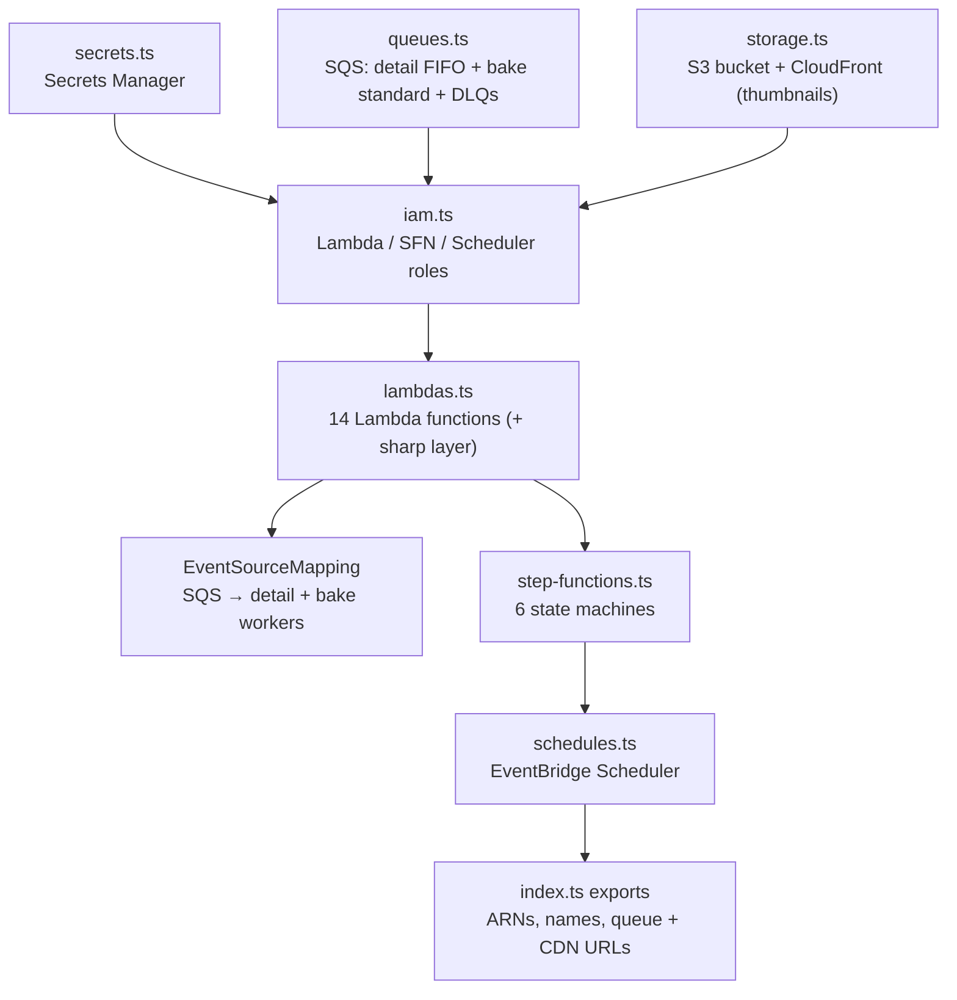
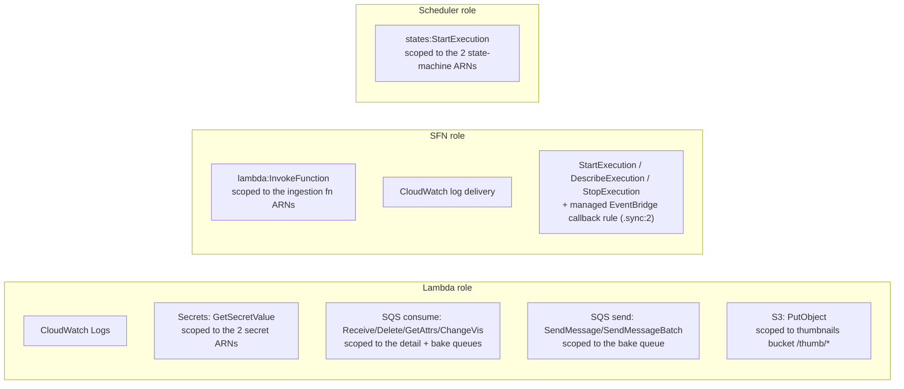

# 06 — Infrastructure (AWS + Pulumi)

All AWS resources are defined in [`infra/src/`](../infra/src/) with **Pulumi
(TypeScript)**. This doc maps the code to the running infrastructure and explains
the non-obvious choices.

Entry point: [`infra/src/index.ts`](../infra/src/index.ts), which wires the
modules in order: **secrets → queues → storage → IAM → Lambdas → Step Functions →
schedules**, then exports the ARNs/names operators need.

```mermaid
flowchart TD
  secrets["secrets.ts<br/>Secrets Manager"] --> iam
  queues["queues.ts<br/>SQS: detail FIFO + bake standard + DLQs"] --> iam
  storage["storage.ts<br/>S3 bucket + CloudFront (thumbnails)"] --> iam
  iam["iam.ts<br/>Lambda / SFN / Scheduler roles"] --> lambdas
  lambdas["lambdas.ts<br/>14 Lambda functions (+ sharp layer)"] --> esm["EventSourceMapping<br/>SQS → detail + bake workers"]
  lambdas --> sfn["step-functions.ts<br/>6 state machines"]
  sfn --> sched["schedules.ts<br/>EventBridge Scheduler"]
  sched --> outputs["index.ts exports<br/>ARNs, names, queue + CDN URLs"]
```

> **Thumbnail bake pipeline (added 2026-07).** Beyond ingestion, this stack also
> runs a card-thumbnail baker: the `bakeThumbnail` Lambda (§4) drains a standard
> SQS queue (§3), resizes each lot's source image with `sharp`, and stores the
> WebP on a private S3 bucket fronted by CloudFront (§3a). The web catalog then
> loads those thumbnails straight from CloudFront, off Vercel's image optimizer.
> See also [04-ingestion-flows.md](04-ingestion-flows.md) (enqueue) and
> [08-web-all-cars-page.md](08-web-all-cars-page.md) (the card).

---

## 1. Stack config & conventions

[`infra/src/config.ts`](../infra/src/config.ts) — typed accessors over Pulumi
config.

| Setting | Source | Default |
|---|---|---|
| `region` | `aws:region` | (required) — convention `eu-central-1` |
| `projectName` | `projectName` | `selectauto` |
| `environment` | `environment` | the stack name |
| `auctionsApiBaseUrl` | `auctionsApiBaseUrl` | `https://auctionsapi.com/api` |
| `hourlySyncScheduleExpression` | config | `rate(1 hour)` |
| `dailyReferenceSyncScheduleExpression` | config | `rate(1 day)` |
| `weeklyDriftSweepScheduleExpression` | config | `cron(0 3 ? * SUN *)` |
| `logRetentionDays` | config | `14` |
| `perPage` | config | `1000` |
| `incrementalMinutes` | config | `75` |
| `auctionsApiKey` | **secret** | — |
| `neonDatabaseUrl` | **secret** | — |

- **Name prefix:** `${projectName}-${environment}` (e.g.
  `selectauto-dev`). Every resource name uses it.
- **Standard tags:** `Project`, `Environment`, `ManagedBy: pulumi`.
- **State backend & auth** follow the shared Pulumi conventions: **S3 state
  backend** (not Pulumi Cloud), `PULUMI_CONFIG_PASSPHRASE` encryption, local **SSO**
  / CI **GitHub OIDC**. `Pulumi.dev.yaml` is committed (holds only encrypted
  secrets). See the repo README + the user's Pulumi conventions.

---

## 2. Secrets ([`secrets.ts`](../infra/src/secrets.ts))

Two Secrets Manager secrets are created — `${prefix}/AUCTIONS_API_KEY` and
`${prefix}/NEON_DATABASE_URL` — with their values pushed from Pulumi config
secrets.

> **Important nuance:** the Lambdas do **not** read Secrets Manager at runtime.
> The secret **values** are also injected directly as Lambda env vars (from the
> same Pulumi config secrets) to keep cold starts simple and avoid an SDK call per
> invocation. The standalone secrets exist for central rotation and for a future
> VPC / runtime-resolution setup. (`requireSecret` keeps values out of plaintext
> previews/outputs.)

---

## 3. SQS ([`queues.ts`](../infra/src/queues.ts))

The detail-refresh rate-limit chokepoint (Flow 5, see [04](04-ingestion-flows.md)).

| Resource | Config |
|---|---|
| `detailRefreshQueue` (`${prefix}-detail-refresh.fifo`) | FIFO; `contentBasedDeduplication: true`; `visibilityTimeout 60s`; `messageRetention 1 day`; redrive → DLQ after `maxReceiveCount 5` |
| `detailRefreshDlq` (`${prefix}-detail-refresh-dlq.fifo`) | FIFO (must match source); `messageRetention 14 days` |
| `bakeThumbnailQueue` (`${prefix}-bake-thumbnail`) | **standard** (NOT FIFO); `visibilityTimeout 120s`; `messageRetention 4 days`; redrive → DLQ after `maxReceiveCount 3` |
| `bakeThumbnailDlq` (`${prefix}-bake-thumbnail-dlq`) | standard; `messageRetention 14 days` |

FIFO + content-dedup collapses duplicate refreshes of the same listing within the
5-minute dedup window into one delivery. The backend must enqueue with a
`MessageGroupId` (e.g. `"auctionsapi"`).

The **bake queue is standard, not FIFO**: bakes are idempotent and
order-independent (one lot id per message, content-addressed output), and the
worker fetches the source-image CDN — not the rate-limited AuctionsAPI — so it
isn't bound by the 1 req/sec budget and may drain concurrently. Standard queues
also make `SendMessageBatch` cheap for the ingestion enqueuers.

---

## 3a. S3 + CloudFront — thumbnail storage

[`storage.ts`](../infra/src/storage.ts). Card thumbnails baked by `bakeThumbnail`
(§4) live on a **private** S3 bucket
fronted by a **CloudFront** distribution — the web catalog loads them from
CloudFront via a plain `` (see [08](08-web-all-cars-page.md)),
bypassing Vercel Image Optimization entirely (which had been ~80% of the web
bill).

| Resource | Config |
|---|---|
| `thumbnailBucket` (`${prefix}-thumbnails`) | `aws.s3.Bucket`; **Block Public Access ON** — reachable only via CloudFront |
| `thumbnail-oac` | CloudFront **Origin Access Control** (SigV4-signs CloudFront→S3) |
| `thumbnail-cdn` | CloudFront distribution; **PriceClass_100** (NA+EU edges); managed **CachingOptimized** policy; `redirect-to-https`; HTTP/2+3 |
| `thumbnail-bucket-policy` | bucket policy allowing `s3:GetObject` **only** from this distribution ARN (`AWS:SourceArn` condition) |

- **Objects** are written by the worker with `Cache-Control: public,
  max-age=31536000, immutable`. Keys are **content-addressed**
  (`thumb/<sha256(image_url)>-640.webp` / `-1280.webp`), so a changed source
  image yields new keys — objects are write-once and **never need CDN
  invalidation**.
- **PriceClass_100** (North America + Europe edges) matches the BG/EU audience at
  lowest cost; bump to `PriceClass_All` for global edges if ever needed.
- **Serving cost** typically sits inside CloudFront's always-free tier
  (1 TB egress + 10M requests/month) at this traffic.

---

## 4. Lambdas ([`lambdas.ts`](../infra/src/lambdas.ts))

### Packaging
Handlers in `packages/functions/` are bundled by
[`build.mjs`](../packages/functions/build.mjs) (esbuild) into **one ESM file per
handler** under `packages/functions/dist/`, with `pg` bundled in and `@aws-sdk/*`
left external (provided by the runtime). Pulumi ships each bundle as `<name>.mjs`
**plus its `<name>.js.map`** (shipped under that exact name so
`NODE_OPTIONS=--enable-source-maps` produces readable stack traces). Pulumi hashes
the bundle content, so **rebuilding + `pulumi up` re-publishes the function with no
infra edit**. Build **before** `pulumi up`.

> **`sharp` exception (bakeThumbnail).** `sharp` has native binaries and cannot be
> inlined into a single-file bundle, so it's marked **external** for the
> `bakeThumbnail` entry and provided at runtime by a **Lambda layer** (`sharp-layer`,
> built from `infra/layers/sharp/` — see its README + [07 §2](07-operations-runbook.md#2-build--deploy)).
> The layer must be `npm install`ed with `--os=linux --cpu=x64 --libc=glibc`
> **before `pulumi up`**, or the worker crashes at import.

### Common settings (all functions)
- runtime **`nodejs20.x`**, ESM from `.mjs`
- shared execution role (logs + secrets + SQS consume)
- env vars: `AUCTIONS_API_BASE_URL`, `AUCTIONS_API_KEY`, `NEON_DATABASE_URL`,
  `PG_POOL_MAX=2`, `NODE_OPTIONS=--enable-source-maps`, `BAKE_QUEUE_URL` (the
  ingestion enqueuers send `needs_bake` lot ids here; harmless on the others)
- a pre-created CloudWatch **log group** with `logRetentionDays` retention (so
  Lambda doesn't create a never-expire one)
- **native JSON logging** (`loggingConfig`: `applicationLogLevel INFO`,
  `systemLogLevel WARN`) — pairs with the structured logger

### The 14 functions (note: several share one bundle)

| Logical name | Bundle | Export | Timeout | Mem | Special |
|---|---|---|---|---|---|
| `syncCarsPage` | syncCarsPage | handler | 300s | 512 | merged fetch+upsert page |
| `syncArchivedLotsPage` | syncArchivedLotsPage | handler | 300s | 512 | merged fetch+archive page |
| `syncReferenceData` | syncReferenceData | handler | 900s | 512 | legacy single-Lambda reference |
| `referenceInit` | syncReferenceData | `referenceInitHandler` | 60s | 256 | loop: upsert mfgs + build worklist |
| `referenceManufacturer` | syncReferenceData | `referenceManufacturerHandler` | 300s | 256 | loop: one manufacturer/step |
| `referenceFinalize` | syncReferenceData | `referenceFinalizeHandler` | 30s | 256 | loop: mark succeeded |
| `refreshListingDetail` | refreshListingDetail | handler | 30s | 256 | **reservedConcurrency 1**, `DETAIL_REFRESH_PACE_MS=1000` |
| `bakeThumbnail` | bakeThumbnail | handler | 60s | 1024 | **sharp layer**; SQS bake worker; `THUMBNAIL_BUCKET` + `THUMBNAIL_CDN_BASE_URL` env |
| `createSyncRun` | syncRunLifecycle | `createHandler` | 30s | 256 | SFN InitSyncRun |
| `finalizeSyncRun` | syncRunLifecycle | `finalizeHandler` | 30s | 256 | SFN FinalizeSyncRun |
| `markSyncFailed` | syncRunLifecycle | `failHandler` | 30s | 256 | SFN MarkSyncFailed |
| `driftSweepInit` | driftSweep | `driftSweepInitHandler` | 30s | 256 | sweep loop: create run, cursor=0 |
| `driftSweepStep` | driftSweep | `driftSweepStepHandler` | 300s | 512 | sweep loop: recompute one car-id window |
| `driftSweepFinalize` | driftSweep | `driftSweepFinalizeHandler` | 30s | 256 | sweep loop: mark succeeded |

The page functions (and `driftSweepStep`) get 300s + 512 MB for headroom (a sync
page does a network call + bulk upsert + two recomputes; a sweep step recomputes a
25k car-id window ≈ ~19s). `refreshListingDetail`'s `reservedConcurrency 1` is the
hard guarantee that no number of users can exceed the rate limit.

### SQS event source mappings (in `index.ts`)
- `detailRefreshQueue` → `refreshListingDetail`, `batchSize 1`,
  `functionResponseTypes: ["ReportBatchItemFailures"]` — each message
  succeeds/fails independently and reservedConcurrency keeps the drain serial.
- `bakeThumbnailQueue` → `bakeThumbnail`, `batchSize 10`,
  `functionResponseTypes: ["ReportBatchItemFailures"]` — no reservedConcurrency
  (bakes hit the source-image CDN, not the rate-limited AuctionsAPI, so they may
  run concurrently); a single bad message doesn't fail the batch.

---

## 5. IAM ([`iam.ts`](../infra/src/iam.ts)) — least privilege

```mermaid
flowchart LR
  subgraph Lambda role
    L1[CloudWatch Logs]
    L2["Secrets: GetSecretValue<br/>scoped to the 2 secret ARNs"]
    L3["SQS consume: Receive/Delete/GetAttrs/ChangeVis<br/>scoped to the detail + bake queues"]
    L4["SQS send: SendMessage/SendMessageBatch<br/>scoped to the bake queue"]
    L5["S3: PutObject<br/>scoped to thumbnails bucket /thumb/*"]
  end
  subgraph SFN role
    S1["lambda:InvokeFunction<br/>scoped to the ingestion fn ARNs"]
    S2[CloudWatch log delivery]
    S3["StartExecution / DescribeExecution / StopExecution<br/>+ managed EventBridge callback rule (.sync:2)"]
  end
  subgraph Scheduler role
    C1["states:StartExecution<br/>scoped to the 2 state-machine ARNs"]
  end
```

- **Lambda role** — `sts:AssumeRole` by `lambda.amazonaws.com`; logs; secret read
  scoped to the two secret ARNs (with the `*` suffix Secrets Manager appends); SQS
  **consume** scoped to the detail + bake queues; SQS **send**
  (`SendMessage`/`SendMessageBatch`) scoped to the bake queue (the ingestion
  enqueuers); **`s3:PutObject`** scoped to the thumbnails bucket `thumb/*` prefix
  (the bake worker). **No VPC permissions** (see §8).
- **Step Functions role** — invoke exactly the ingestion Lambda ARNs (+ versioned
  `:*`); log delivery; and (added in `index.ts`) the `StartExecution` /
  `DescribeExecution` / `StopExecution` + managed EventBridge rule permissions the
  `.sync:2` nested-execution integration requires (the rule perm is scoped to the
  single managed rule in this account/region, not a wildcard).
- **Scheduler role** — `states:StartExecution` scoped to the three scheduled state
  machine ARNs (combined-hourly, reference, drift-sweep).

---

## 6. Step Functions ([`step-functions.ts`](../infra/src/step-functions.ts))

Six `STANDARD` state machines (full ASL walkthrough in
[04-ingestion-flows.md](04-ingestion-flows.md)):

| Machine | Shape | Sync Lambda(s) |
|---|---|---|
| `full-inventory-backfill` | paginated loop | `syncCarsPage` |
| `hourly-cars-sync` | paginated loop | `syncCarsPage` |
| `archived-lots-sync` | paginated loop | `syncArchivedLotsPage` |
| `combined-hourly-sync` | sequential nest (`startExecution.sync:2`) | the two hourly machines |
| `reference-sync` | manufacturer-index loop | `referenceInit`/`Manufacturer`/`Finalize` |
| `drift-sweep` | car-id keyset loop | `driftSweepInit`/`Step`/`Finalize` |

Each has a dedicated CloudWatch log group
(`/aws/vendedlogs/states/${prefix}-<name>`) with `level: ERROR` +
`includeExecutionData`.

---

## 7. EventBridge Scheduler ([`schedules.ts`](../infra/src/schedules.ts))

Three schedules, all targeting **state machines** (no Lambda targets):
`hourly-combined-sync` → `combinedHourlySync`, `daily-reference-sync` →
`referenceSync`, `weekly-drift-sweep` → `driftSweep` (`cron(0 3 ? * SUN *)`, the
projection self-heal). See the table in [04 §Schedules](04-ingestion-flows.md#schedules-eventbridge-scheduler).
`aws.scheduler.Schedule` doesn't accept tags (tagging is per schedule-group; the
default group is used).

---

## 8. The "no VPC" decision

The Lambdas have **no VPC config** and reach Neon over the **public internet**
using the Neon **pooled** (PgBouncer) connection string. Rationale:

- Neon's endpoint is public + TLS — full cert validation works without a custom CA.
- No VPC means **no NAT gateway cost** and **no cold-start ENI penalty**.
- The pooled endpoint (PgBouncer, transaction pooling) lets thousands of
  short-lived invocations share Postgres backends — but it forbids **named
  prepared statements**, which is why the DB layer uses raw `pg` with a tiny pool
  (`max 2`) and no prepared statements. See [`shared/db.ts`](../packages/functions/shared/db.ts).

---

## 9. Outputs (what `pulumi up` exports)

From [`index.ts`](../infra/src/index.ts):

- `region`, `prefix`
- `stateMachineArns` — fullInventoryBackfill, hourlyCarsSync, archivedLotsSync,
  combinedHourlySync, referenceSync, driftSweep
- `lambdaNames` — all 14 functions (incl. `bakeThumbnail`)
- `scheduleNames` — hourlyCombinedSync, dailyReferenceSync, weeklyDriftSweep
- `secretNames` — the two secret names (not values)
- **`detailRefreshQueueUrl`**, `detailRefreshQueueArn`, `detailRefreshDlqUrl` —
  the app backend enqueues to `detailRefreshQueueUrl` (FIFO: include a
  `MessageGroupId`)
- **`bakeThumbnailQueueUrl`**, `bakeThumbnailQueueArn`, `bakeThumbnailDlqUrl` —
  the thumbnail backfill script (`backfill-thumbnails.mjs`) enqueues here
- **`thumbnailBucketName`**, **`thumbnailCdnBaseUrl`**, `thumbnailCdnDistributionId`
  — the CloudFront base URL the bake worker stores in `thumbnail_url`

See [07-operations-runbook.md](07-operations-runbook.md) for how to start
machines from these outputs.
