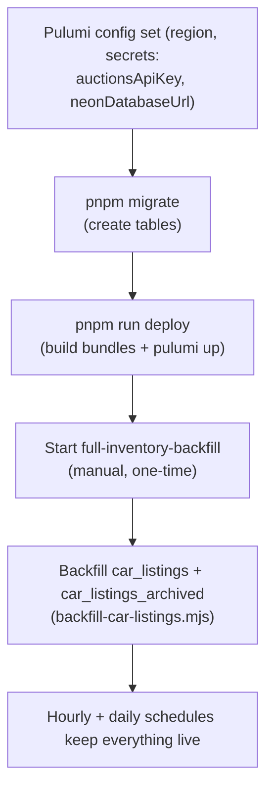

# 07 — Operations Runbook

Build, deploy, migrate, run, resume, and troubleshoot the ingestion system.
Commands are run from the repo root unless noted. The repo is a **pnpm
monorepo** (`pnpm@10.28.0`); `NEON_DATABASE_URL` is auto-loaded from the repo-root
`.env` by the migrate/backfill npm scripts (`node --env-file-if-exists`).

> Shell note: this repo is on Windows/PowerShell. Bash-style `VAR=...` inline env
> prefixes don't work in PowerShell — use `$env:VAR = "..."`.

---

## 1. First-time setup (order matters)



---

## 2. Build & deploy

| Command | What it does |
|---|---|
| `pnpm run build:functions` | esbuild bundles → `packages/functions/dist/` |
| `pnpm run deploy` | build bundles **then** `pulumi up` |
| `pnpm run preview` | build bundles **then** `pulumi preview` |
| `pnpm run type-check` | tsc `--noEmit` across functions/infra/db |
| `pnpm run lint` | eslint |
| `pnpm run check` | type-check + lint |

**Re-deploying a code change:** edit a handler → `pnpm run deploy`. The bundle
hash changes, so Pulumi re-publishes the function with **no infra edit**. (`pulumi
up` runs in `infra/`; ensure AWS auth — `aws sso login` / `$env:AWS_PROFILE`.)

> ⚠️ The `car_listings` ingestion hooks only go live after a `pulumi up` that
> deploys the current `db.ts`/`normalize.ts`. Until then the projection tables are
> a **static backfilled snapshot**, not kept live.

---

## 3. Database migrations

Plain SQL, **append-only**, **hand-run** (never auto-applied on deploy). Runner:
[`migrate.mjs`](../packages/db/migrate.mjs); tracked in the `_migrations` table;
all migrations use `IF NOT EXISTS` / `CREATE OR REPLACE`, so re-runs are safe.

```bash
pnpm migrate          # apply all pending migrations
pnpm migrate:status   # list applied + pending, apply nothing
```

**Adding a migration:** create `packages/db/migrations/00NN_description.sql`
(next number), keep [`schema.ts`](../packages/db/schema.ts) in sync, run
`pnpm migrate`. Use the Neon **direct** (non-pooled) connection string for heavy
DDL if the pooled endpoint gives trouble (simple statements work on pooled too).

---

## 4. Running the flows

### Hourly + daily (automatic)
The `hourly-combined-sync` and `daily-reference-sync` EventBridge schedules run
themselves. Nothing to do.

### Full inventory backfill (manual, one-time / re-seed)
Start the `full-inventory-backfill` state machine (ARN from the `stateMachineArns`
output) with:
```json
{ "flowType": "full_backfill", "mode": "full", "page": 1, "perPage": 1000 }
```
(`minutes` omitted = all active cars.) Start it from the AWS console or:
```powershell
aws stepfunctions start-execution `
  --state-machine-arn <fullInventoryBackfill ARN> `
  --input '{"flowType":"full_backfill","mode":"full","page":1,"perPage":1000}'
```

### Reference sync (manual / forced)
Start `reference-sync` with `{ "includeEmpty": false }` (or `true` to also expand
zero-car manufacturers). After a **partial** reference failure, the legacy
single-Lambda path needs `{ "force": true }` (its skip gate checks presence, not
completeness) — but prefer the state-machine loop, which re-upserts manufacturers
each run.

### Detail refresh (Flow 5)
Enqueue to `detailRefreshQueueUrl` (FIFO — include a `MessageGroupId`):
```json
{ "lot": "45289258", "domain": "iaai_com", "pricesHistory": true }
{ "vin": "WBA3B5G55FNS17722", "pricesHistory": true }
```
The single-concurrency worker drains it at ~1 req/sec. *(App-side enqueue is not
wired yet — see [04](04-ingestion-flows.md#flow-5--detail-refresh-sqs-fifo-drain-worker).)*

---

## 5. Backfilling the computed read models

After a full backfill (or to repair drift), populate the projections with
[`backfill-car-listings.mjs`](../packages/db/backfill-car-listings.mjs) — it calls
the same recompute functions ingestion uses, so no drift:

```bash
# from packages/db/
node --env-file-if-exists=../../.env backfill-car-listings.mjs                                  # car_listings
node --env-file-if-exists=../../.env backfill-car-listings.mjs --fn=recompute_archived_car_listings  # car_listings_archived
# resume / tune
node --env-file-if-exists=../../.env backfill-car-listings.mjs --start=500000 --batch=25000 --sleep=50
```
Safe to run against prod while ingestion runs (idempotent, write-isolated to the
projection, reads only cars/auction_lots). Run **both** functions to keep the
tables disjoint + complete.

---

## 6. Resume a failed run

Every paginated run checkpoints `sync_runs.last_page_processed` as it advances.
There is **no automatic resume** yet; an operator resumes manually:

1. Find the unfinished run (`findResumePoint` logic / query):
   ```sql
   SELECT id, last_page_processed
   FROM sync_runs
   WHERE flow_type = 'full_backfill' AND status IN ('running','failed')
   ORDER BY started_at DESC LIMIT 1;
   ```
2. Start a new execution with `page = last_page_processed + 1` (same `mode`,
   `perPage`, `minutes`).

Re-running is safe regardless: upserts are idempotent (`ON CONFLICT`) and recompute
is order-independent, so an overlapping resume produces no duplicates.

---

## 7. Observability

- **`sync_runs` table** — one row per execution: status, `pages_processed`,
  `records_processed`, `last_page_processed`, `error_message`, `metadata_json`.
- **Structured JSON logs** (CloudWatch) from [`logger.ts`](../packages/functions/shared/logger.ts).
  Each line is one JSON object with persistent context (`flowType`, `syncRunId`,
  `page`) + event fields. Useful events: `fetch_cars_page`, `upsert_cars_page`,
  `sync_cars_page_result`, `fetch_archived_lots_page`, `archive_lots_page`,
  `recompute_car_listings_failed`, `detail_refresh_done`. Query in **Logs
  Insights** by field, e.g.:
  ```
  fields @timestamp, durationMs, upsertedThisPage
  | filter event = "sync_cars_page_result"
  | stats avg(durationMs), sum(upsertedThisPage) by flowType
  ```
- **Step Functions execution history** — per-machine log groups
  (`/aws/vendedlogs/states/...`, `level: ERROR`, execution data included).

---

## 8. Troubleshooting

| Symptom | Cause | Fix |
|---|---|---|
| `Function.ResponseSizeTooLarge` | a page's data tried to cross SFN state | Already designed out (merged fetch+write). If it reappears, ensure no handler returns `page.data`. |
| `value out of range for type integer` | odometer/counter > INT max | `odometer_km`/`records_processed` are BIGINT (migration 0002). Apply migrations. |
| `invalid input syntax for type bigint` (price) | fractional price into BIGINT | prices are `NUMERIC(14,4)` (migration 0003). Apply migrations. |
| Migration hangs / `canceling statement due to lock timeout` | a writer (running sync) holds the table | Migrations set `lock_timeout 5s` to fail fast. Stop the blocking sync/clear the connection, re-run. |
| `canceling statement due to statement timeout` during a type change | full-table rewrite exceeds Neon's default timeout | 0003 sets `statement_timeout 0` for that txn. Use it / the direct connection. |
| node-postgres `SECURITY WARNING ... sslmode` | redundant `sslmode` in the URL | `db.ts`/`migrate.mjs` strip `sslmode` and configure TLS via the `ssl` object. Harmless. |
| Reference catalog half-synced | legacy single-Lambda timed out / skip gate returned early | Run the `reference-sync` state machine (or legacy with `{force:true}`). |
| `car_listings` stale / a sold car still shows active | recompute hooks not deployed, or a swallowed best-effort recompute | `pulumi up` to deploy hooks; re-run `backfill-car-listings.mjs` (both fns) as a drift sweep. |
| Detail refreshes overwhelming the API | concurrency/pacing misconfigured | Confirm `refreshListingDetail` `reservedConcurrency = 1` and `DETAIL_REFRESH_PACE_MS`. |
| AuctionsApiError 4xx (not 429) failing a run | terminal upstream error (bad key/param) | Check the key/params; 4xx is non-retryable by design. |

---

## 9. Quick reference — files to touch for common changes

| I want to… | Edit |
|---|---|
| Map a new upstream field to a column | `shared/normalize.ts` + `shared/types.ts` + `schema.ts` + a new migration + (if displayed) a recompute fn |
| Add/adjust a read-model column or pick-strategy | a new `00NN_*.sql` (`CREATE OR REPLACE` the recompute fn) + `schema.ts` + re-run backfill |
| Change sync cadence / window / page size | Pulumi config (`hourlySyncScheduleExpression`, `incrementalMinutes`, `perPage`) → `pulumi up` |
| Add a new Lambda/handler | `packages/functions/<name>/handler.ts` → add to `build.mjs` entries → `lambdas.ts` |
| Change a state machine | `infra/src/step-functions.ts` |
| Rotate a secret | update Pulumi config secret → `pulumi up` (and rotate in Secrets Manager) |
