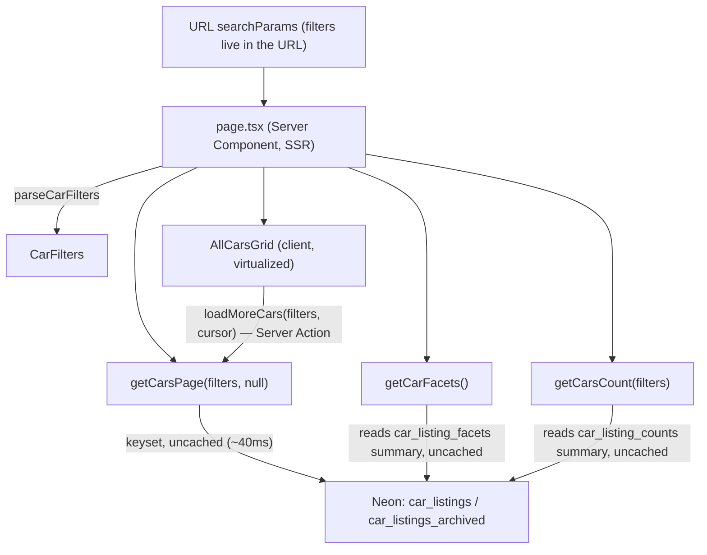

# 08 — Website: the All-Cars Catalog (`/vsichki-avtomobili`)

The `apps/web` (Next.js 16, App Router, Cache Components/PPR) page that renders the
car catalog by reading the computed read models ([05](05-projection-tables-car-listings.md))
**single-table, zero joins**. This doc covers the page, its filters, the
active/past views, and how the app consumes the data. Deeper design records:
`apps/web/ALL-CARS-PLAN.md`, `apps/web/ALL-CARS-DB-DESIGN.md`.

> **Route slug.** The page lives at **`/vsichki-avtomobili`** (Latin
> transliteration). It must NOT be the Cyrillic `всички-автомобили` — that folder
> name broke `next build` with `InvalidCharacterError` during prerender. Nav/
> footer/hero links use the Latin slug.

---

## 1. What the page is

A production catalog of every importable car, recreating the legacy WordPress
`[mixed_cars_grid]` page in the app's own stack. Two views behind one URL:

- **Активни** (default) — the live catalog, reads `car_listings`.
- **Приключили** (`?status=past`) — concluded/sold auctions for price research,
  reads `car_listings_archived`. Rendered `noindex` (see §6).

The first page is **SSR** (good LCP + SEO); the grid then **virtualizes +
infinite-scrolls** client-side (`@tanstack/react-virtual`, window virtualizer) by
calling a Server Action for subsequent pages. Conversion path = **per-card phone /
Viber** buttons (active view only), like the legacy card. No detail page yet
("Подробности" links to a section page; the detail route + its SQS-refresh is a
documented follow-up).

---

## 2. Data flow (web side)



- **The URL is the single source of truth** for filter state. `page.tsx` reads
  `searchParams` (a request-time API) → `parseCarFilters` → passes `CarFilters` as
  **arguments** into the queries. Because it reads `searchParams`, the route is
  **dynamic** (renders **`◐ Partial Prerender`** — static shell + streamed grid).
- **The catalog queries are NOT app-cached** — and deliberately so. They're already
  DB-cheap: `getCarsPage` is a keyset read (~40ms, flat at any depth), `getCarsCount`
  is an O(1) lookup in the `car_listing_counts` summary (migration 0016), and
  `getCarFacets` reads the `car_listing_facets` summary (migration 0017, ~40ms)
  instead of 8 GROUP-BY/DISTINCT passes. Their cache keys would also be
  per-request-unique (filters × cursor) → near-zero hit rate. The summary tables are
  the "cache" — maintained at write time by ingestion, not per request. (Only the
  *homepage* queries — `getBuyNowCars`/`getAuctionCars`/`getCarBrands` — use
  `"use cache"`; see `lib/cache-tags.ts` for the full rationale.)
- Changing a tab/filter pushes a new URL → page re-renders SSR for the new filter
  set; the client grid remounts (keyed on the serialized filters) and resets.

Key files (`apps/web/src/`):

| Path | Role |
|---|---|
| `app/vsichki-avtomobili/page.tsx` + `loading.tsx` | SSR shell, `generateMetadata` (noindex when past), streams the grid |
| `types/car-filters.type.ts` | `CarFilters`, `FacetOptions`, `CarsPage` |
| `lib/car-filters.ts` | parse/serialize `CarFilters` ⇄ `URLSearchParams` (symmetric) |
| `schemas/car-filters.schema.ts` | zod validate/clamp (used by the Server Action) |
| `lib/car-labels.ts` | BG label maps (status/condition/drive/transmission/color/**vehicle_type**/**body_type**/damage) |
| `lib/car-mapper.ts` | `carListingToView(row, isPast)` — a projection row → card view-model |
| `queries/cars/get-cars-page.query.ts` | keyset page (active or past), + search branch; uncached |
| `queries/cars/get-cars-count.query.ts` | **exact** count — `car_listing_counts` summary (0016) for broad views, live `COUNT` for narrow; uncached |
| `queries/cars/get-car-facets.query.ts` | dropdown options (brands/models/colors/drives/**types**/years) from the `car_listing_facets` summary (0017); uncached. Also exports `getCarBrands` (homepage, **`"use cache"`**) |
| `mutations/cars/load-more-cars.action.ts` | `"use server"` infinite-scroll loader |
| `components/cars/all-cars/*` | `AllCarsGrid`, `AuctionCard`, `AuctionCountdown`, `CarFilterBar`, `CarGridSkeleton` |

---

## 3. Filters (every filter → a single `car_listings` column)

`CarFilters` maps 1:1 to projection columns, so every predicate is single-table.
`tableFor(filters)` picks `car_listings` (active) or `car_listings_archived` (past)
— both have identical shape, so the same `buildConditions` + mapper serve both.

| Filter (`CarFilters`) | UI | Predicate |
|---|---|---|
| `status` | "Активни \| Приключили" toggle | selects the **table** (past → archived) |
| `channel` | "Само с Buy Now" toggle | `buy-now` → `buy_now=true AND effective_price>0`; `auction` → not-that |
| `market` | САЩ / Корея / Канада segmented | `location_country` = `USA` / `kr` / `Canada` (**not** `domain_name`) |
| `brand` / `model` | dropdowns (model brand-scoped) | `manufacturer_id` / `model_id` (external ids) |
| `color` | dropdown | `car_color` (canonical name) |
| `drive` | dropdown | `drive_wheel` (front/all/rear) |
| `condition` | **"Състояние" dropdown** | `condition` IN (raws) — options grouped by BG label (one label can cover several raws, e.g. `run_and_drives,engine_starts` → "Пали и се движи") |
| `type` | **"Тип" dropdown** (combined) | see §3a |
| `yearFrom` / `yearTo` | "Година от" / "Година до" inputs | `car_year >= from` / `<= to` (a real range) |
| `priceMin` / `priceMax` | "Цена от/до" inputs | range on `effective_price` |
| `search` | "Лот № / VIN" | exact lookup (see §3b) |

### 3a. The combined "Тип" filter (vehicle_type + body_type)

We store **both** `vehicle_type` (top category: automobile/truck/boat/moto/…) and
`body_type` (car sub-shape: suv/sedan/pickup/…). The "Тип" dropdown is **one
control over two columns**, using a prefixed value:

- `vt:<value>` → `vehicle_type` (non-car categories — **boat**, truck, motorcycle,
  bus, atv, jet_sky, trailers, …). ~873k of ~930k active cars are `automobile`;
  the rest are these.
- `bt:<value>` → `body_type` (for cars — SUV, sedan, pickup, van, coupe, …).

`getCarFacets` builds the options as: every non-`automobile` `vehicle_type` (as
`vt:*`) **plus** the `body_type`s that `automobile` cars actually have (as `bt:*`),
each with a count, sorted by frequency. BG labels come from `VEHICLE_TYPE_BG` /
`BODY_TYPE_BG` in `car-labels.ts` (e.g. `vt:boat` → "Лодка", `bt:suv` → "Джип (SUV)").
The query splits the prefix and targets the right column. (Boats ≈ 1,503 active;
trucks ≈ 24.5k; motorcycles ≈ 10k.)

### 3b. Search is a lookup, not a feed

When `filters.search` is present, `getCarsPage` runs an **exact lookup**
(`lot_number LIKE 'q%' OR vin = 'Q'`, small `LIMIT`, **no `sort_id` ordering**).
Verified: adding `ORDER BY sort_id DESC` to a lot search makes the planner ignore
`cl_lotnumber`/`cl_vin` (37,888 buffers vs ~26). Search results don't need infinite
scroll.

---

## 4. Pagination (keyset) + the grid

- **Keyset on `sort_id DESC`** (the chosen lot id — unique, monotonic). The query
  fetches `PAGE+1`; if the extra row exists there's a next page and
  `nextCursor = sort_id of row[PAGE-1]`, else `null`. Flat cost at any depth (no
  OFFSET — unusable at ~1M rows). `PAGE_SIZE = 24`.
- **`AllCarsGrid`** (client) seeds from the SSR first page, then calls the
  **`loadMoreCars` Server Action** with `(filters, cursor)` when the user nears the
  end (`useTransition`), appends results, advances the cursor until `nextCursor ===
  null`. Window-virtualizes **rows** of N responsive columns (1/2/3/4 by
  breakpoint via a `ResizeObserver`); remounts (resets) when filters change.
- `loadMoreCars` re-validates input with `safeParseCarFilters` (a Server Action is
  reachable by direct POST — never trust the client filter shape) and forwards to
  the same cached `getCarsPage`, so SSR page 1 and scroll pages share cache entries.

---

## 5. The card (`AuctionCard`) + i18n

A projection row → `CarView` via `carListingToView(row, isPast)`. Renders source +
BUY-NOW badges, a status/countdown bar (live `AuctionCountdown` to `sale_date` for
active auctions; static pill otherwise), a 2-col info grid (lot №, date, mileage,
condition, damage, engine, drivetrain, gearbox, seller — each shown only if
present), a price row, and a CTA.

- **Past mode** (`isPast`): "ПРОДАДЕН" badge + "Продаден за €X" (realized price,
  `final_bid`-preferred) + sale date; **no** phone/Viber/countdown/buy CTA (a sold
  car is research data, not a lead) — instead a "Виж активни обяви" link.
- **i18n** (per [03](03-normalization-and-field-mapping.md)): values are stored raw
  canonical English; BG labels are applied **here at render** via `car-labels.ts`,
  not in ingestion. Enum maps (status/condition/drive/transmission/color/
  vehicle_type/body_type) are complete against the API enums; `damage_main` has a
  curated head + verbatim tail; `engine`/`title`/`seller` are verbatim passthrough.
- **Title de-duplication:** some upstream titles already start with the year
  (`"2015 Nissan…"`); the mapper only prepends `car_year` when the title doesn't
  already start with `\d{4}` (avoids "2015 2015 Nissan…").

`next/image` remote hosts are whitelisted in `apps/web/next.config.ts`
(`i.auctionsapi.com` is ~99.9%, plus encar/copart/iaai/ironplanet CDNs).

---

## 6. SEO

- **Active catalog** — fully indexable.
- **Past view (`?status=past`) — `noindex, follow`** (set in `generateMetadata`).
  Reason: ~144k thin, fast-decaying, non-actionable sold-car URLs are exactly the
  programmatic-SEO pattern Google penalizes and would waste crawl budget. Users get
  it as a price-research utility; crawlers follow through but don't index it.
- **The indexable SEO play is a FUTURE feature (not built):** model-level
  **auction-price pages** ("BMW 530 цени от търг" → avg/min/max/count + recent
  examples, `Product`/`AggregateOffer` JSON-LD, in the sitemap), which can use the
  archive data and/or the AuctionsAPI `/statistics` endpoint
  ([01 §9](01-auctionsapi-consumption.md)).

---

## 7. How the page stays correct (ties back to ingestion)

The page is a pure **read** surface; freshness comes entirely from ingestion
maintaining the read models ([04](04-ingestion-flows.md) / [05](05-projection-tables-car-listings.md)):

- The hourly cars + archived syncs recompute **both** projections on every write,
  keeping active/past **disjoint** — so the toggle never shows a car in both.
- Until the ingestion hooks are deployed (`pulumi up` after the `db.ts`/
  `normalize.ts` changes), the projections are a **static backfilled snapshot**;
  the page renders correctly but data won't auto-update. Re-run
  `backfill-car-listings.mjs` (both fns) as a drift sweep if needed.

---

## 8. Build / verify (web)

```bash
pnpm --filter @auctions-ingestion/web run type-check
pnpm --filter @auctions-ingestion/web run lint
pnpm --filter @auctions-ingestion/web run build      # route should show ◐ (PPR)
pnpm --filter @auctions-ingestion/web run dev         # http://localhost:3000/vsichki-avtomobili/
```

> **Caching note:** the catalog queries are **uncached** (they read Neon every
> request — fast via the summary tables), so a DB/data change shows immediately on
> `/vsichki-avtomobili` with no cache to clear. The `"use cache"` gotcha only
> applies to the **homepage** (`getBuyNowCars`/`getAuctionCars`/`getCarBrands`):
> in dev the cached output sticks until you clear `.next`; in prod it refreshes on
> the `cacheLife` TTL (hours/days). Catalog freshness is bounded only by how
> current the projection is (ingestion + the weekly drift sweep).

---

## 9. Status & deliberate gaps

- **Built + verified** against live prod: both views serve 200, all filters work
  (market, channel, brand/model, color, drive, **type incl. boats**, **year
  range**, search), past view is sold-only + `noindex`, keyset paginates flat,
  i18n has no leaks. Type-check/lint/build green.
- **Built + verified**: the car **detail page** `/avtomobil/[id]` (see §10).
- **Deferred follow-ups** (documented, not bugs): wiring the **detail-refresh SQS
  enqueue** (refresh-on-visit for stale cars), the **model-level price SEO pages**,
  and inquiry-modal-per-card.
- **One browser check** is the only thing not verifiable headlessly: that the
  virtualized grid paints + infinite-scroll loads more in a real browser (the data
  reaching the client is confirmed; client paint needs eyes on it).

---

## 10. The car detail page (`/avtomobil/[id]`)

The single-car page the catalog cards ("Подробности") link to. Where the catalog
reads the **lean** `car_listings` row, the detail page is the **rich** view: it
loads the one car + its chosen lot and reads into both `raw_json` blobs for
everything that isn't promoted to a projection column.

- **Route**: `src/app/avtomobil/[id]/page.tsx`. `[id]` is the **`car_id`** (the
  projection PK), no trailing slash (the site canonicalizes slashless — the card
  `href` in `car-mapper.ts` matches). PPR: a static shell (header/footer) renders,
  the body streams inside `<Suspense>` (awaiting `params` at the root would block
  the route — the build rejects it).
- **Query**: `getCarDetail(carId)` (`get-car-detail.query.ts`, **uncached** — a
  cheap single-row lookup, and one entry per ~935k car ids isn't worth caching).
  Resolves the listing row in **`car_listings` first, then
  `car_listings_archived`** — so a concluded car still resolves (renders as a past
  result + `noindex`). Then joins `cars` + the chosen `auction_lots` row for the
  raw_json, and resolves brand/model names (same as the facets query). Returns the
  `CarDetail` + a few same-model (else same-brand) **related** active cars.
- **What raw_json adds** (only there, not columns — coverage over 2k active cars):
  the full **image gallery** (≈99% have multiple; 5 CDN `downloaded` + 10-20
  `normal`), appraisal **prices** (ACV, est. repair, clean wholesale, pre-accident),
  **damage.second**, **detailed_title** (Salvage/Clean…), **keys/airbags**,
  **seller_type / auction_type / selling_branch / grade_iaai**, **cylinders**. Each
  renders only when present (uneven per source — IAAI is richer than Copart). The
  parse + BG localization lives in `lib/car-detail-mapper.ts` (+ new label maps in
  `car-labels.ts`: seller/auction/title-doc/airbags/fuel).
- **Layout**: two-column desktop (gallery + spec sheet left; price + status +
  contact panel sticky right), stacked mobile. Components in
  `components/cars/car-detail/` (`CarGallery` is the one client part — thumbnail
  strip + lightbox + keyboard nav; the rest are server). Related cars reuse the
  catalog `AuctionCard`.
- **SEO**: active cars are indexable with `Vehicle`/`Product`+`Offer` **JSON-LD**
  (`lib/car-detail-jsonld.ts`) + canonical + OG; concluded cars are
  `noindex, follow` and emit no JSON-LD (a sold price as an active Offer would
  mislead). A missing/invalid id renders the not-found UI (with `noindex`) — note
  it's HTTP 200, not 404, an inherent PPR trade-off (the noindex is what matters).
