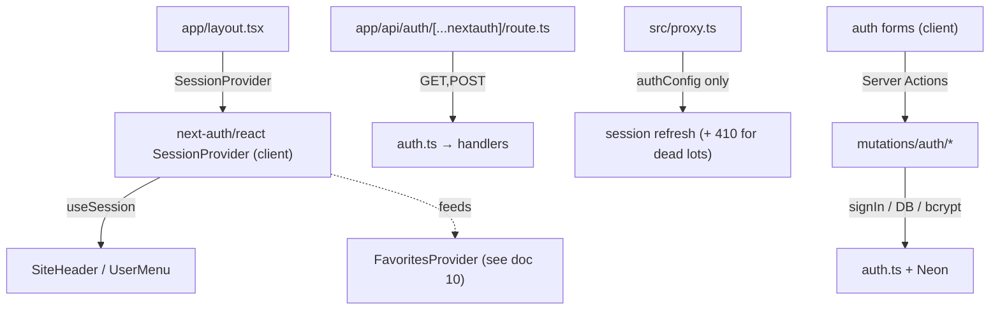

# 09 — Website: Authentication (Auth.js)

The `apps/web` (Next.js 16, App Router, Cache Components/PPR) **authentication**
feature: self-hosted **Auth.js (NextAuth v5)** — Google OAuth + email/password
(Credentials) with **JWT sessions**.

This doc covers the **application layer** (session model, flows, UI wiring,
security). The **table shapes** (`users`, `accounts`, `verification_tokens`,
`password_reset_tokens`) live in [02 §H](02-data-model-and-tables.md) + migration
[`0019_auth.sql`](../packages/db/migrations/0019_auth.sql). The **favourites**
feature that sits on top of auth has its own doc:
[10-web-favorites.md](10-web-favorites.md).

> **Why self-hosted.** Auth was previously a third-party managed provider; it was
> replaced with Auth.js so the whole flow (users, sessions, emails) lives in our
> own Neon DB + Resend — no per-seat SaaS cost, no external identity dependency.

---

## 1. Architecture at a glance

| Concern | Choice | Why |
|---|---|---|
| Library | **Auth.js / NextAuth `5.0.0-beta.31`** + `@auth/drizzle-adapter` | App-Router-native, self-hosted, Drizzle-backed |
| Providers | **Google** (OAuth) + **Credentials** (email/password) | social + self-hosted login |
| Sessions | **JWT** (stateless signed cookie) — `session.strategy: "jwt"` | no per-request DB read, no `sessions` table; fits Neon-serverless + `cacheComponents` |
| Password hashing | **bcrypt** (`bcryptjs`), cost **12** | industry standard; password capped at 72 bytes (bcrypt truncation) |
| Route protection | **per-action**, NOT middleware/route gating | the site is public; only user-scoped writes (favourites) need a user |
| Emails | **Resend** (`noreply@selectauto.bg`) | same client as the Carfax/inquiry notifications ([`lib/email.ts`](../apps/web/src/lib/email.ts)) |

### 1a. The edge/node split (two config objects)

Auth.js is assembled from **two** files so the proxy stays light:

- **[`src/auth.config.ts`](../apps/web/src/auth.config.ts)** — the shared, dependency-light config: Google
  provider, JWT session strategy, `pages.signIn`, and the `jwt`/`session`/`authorized`
  callbacks. Imports **nothing** Node-only (no DB adapter, no bcrypt).
- **[`src/auth.ts`](../apps/web/src/auth.ts)** — the full server instance: spreads `authConfig` and adds the
  **Drizzle adapter** (persists users/accounts/verification tokens) + the
  **Credentials provider** (bcrypt + DB lookup in `authorize`). Exports `auth`
  (read the session server-side), `signIn`/`signOut` (server auth actions), and
  `handlers` (the route).

The proxy imports **only** `authConfig`; server components, actions, and the route
handler import from `auth.ts`.

> **Runtime note (Next 16).** The historical reason for the split was edge
> compatibility. Next 16 runs the proxy on the **Node.js runtime** (edge is not
> supported and the `runtime` option throws in a proxy file — verified against
> `next/dist/docs/.../file-conventions/proxy.md`), so the split no longer implies
> "no DB". It's still correct: it keeps the proxy bundle small and concerns
> separated.

### 1b. Where each piece is wired



- **`SessionProvider`** ([`app/layout.tsx`](../apps/web/src/app/layout.tsx)) is a **client** provider that fetches
  the session via `/api/auth/session`. It does **not** read request headers during
  render, so it does **not** force the static shell dynamic under `cacheComponents`
  — no Suspense wrapper needed around it.
- **Route handler** ([`app/api/auth/[...nextauth]/route.ts`](../apps/web/src/app/api/auth/[...nextauth]/route.ts)) exposes the Auth.js
  endpoints (`callback`, `session`, `csrf`, `signin`, `signout`, `providers`) under
  `/api/auth/*`. Node runtime by default (needed for bcrypt + the DB adapter); we do
  **not** set `export const runtime` because `cacheComponents` rejects route-segment
  runtime config.
- **Proxy** ([`src/proxy.ts`](../apps/web/src/proxy.ts)) wraps `NextAuth(authConfig)` and just refreshes/propagates
  the session (its other job is the SEO `410` for long-dead sold lots). No routes are
  force-protected — `authorized()` returns `true` unconditionally.

### 1c. Session callbacks & the `user.id`

- **`jwt({ token, user })`** — on initial sign-in (`user` present) writes
  `token.id = user.id`; afterwards passes the existing token through.
- **`session({ session, token })`** — copies `token.id` onto **`session.user.id`**.
- The `session.user.id` field is added by module augmentation in
  [`src/types/next-auth.d.ts`](../apps/web/src/types/next-auth.d.ts) (augments both `Session` and `JWT`). This is what
  server code and the client (`useSession`) read to identify the user without a DB
  round-trip.

---

## 2. The flows

All the write flows are **Server Actions** in `mutations/auth/*` returning the
shared `ActionResult<T>` (`{success:true,data} | {success:false,error}`), consumed
by react-hook-form + zod forms in `components/auth/*`. Schemas are shared
client/server in [`schemas/auth.schema.ts`](../apps/web/src/schemas/auth.schema.ts) (BG error messages).

### 2a. Sign-up + email verification

`signUp` ([`sign-up.mutation.ts`](../apps/web/src/mutations/auth/sign-up.mutation.ts)) → validate → **bcrypt(12)** the password →
insert a `users` row with `email_verified = NULL` → issue a token into
`verification_tokens` (identifier = lowercased email, 24h TTL) → email the
`/verify?token=…` link via Resend. The user **cannot sign in until verified**.

`verifyEmail` ([`verify-email.mutation.ts`](../apps/web/src/mutations/auth/verify-email.mutation.ts)) → look up a non-expired token →
set `users.email_verified = now()` (matched by `lower(email)`) → delete the
token(s) for that identifier (single-use). Driven client-side once on mount by
[`verify-email-client.tsx`](../apps/web/src/components/auth/verify-email-client.tsx) (a `ran` ref guards React strict-mode double-fire
from consuming the single-use token twice).

> **Enumeration protection.** An already-registered email returns the **same
> neutral "check your inbox" success** — no duplicate row, no resend.

### 2b. Credentials sign-in

`credentialsSignIn` ([`credentials-sign-in.mutation.ts`](../apps/web/src/mutations/auth/credentials-sign-in.mutation.ts)) wraps
`signIn("credentials", { …, redirect: false })` so control stays in the action and
it can return an `ActionResult`. The `authorize` callback (in `auth.ts`):

1. zod-validates the pair;
2. looks up the user case-insensitively (`lower(email)`);
3. fails for no-user **or** an OAuth-only user (`passwordHash` NULL);
4. **throws `EMAIL_NOT_VERIFIED`** if `email_verified` is NULL;
5. `bcrypt.compare`s the password.

Error mapping: `EMAIL_NOT_VERIFIED` → a specific "потвърдете имейла" prompt; any
other `CredentialsSignin` → generic "грешен имейл или парола" (never leaks which
half was wrong).

> **Client session refresh (important).** The sign-in runs through a **Server
> Action**, so next-auth's client `SessionProvider` doesn't learn about the cookie
> it just set (the provider only refetches on mount, tab-focus, or its own client
> `signIn()`). [`sign-in-form.tsx`](../apps/web/src/components/auth/sign-in-form.tsx) therefore calls **`await useSession().update()`**
> on success — forcing a `/api/auth/session` refetch — *before* `router.push`. Without
> this the header (and the favourites provider, doc 10) stay "signed out" until a
> manual reload. **Verified in-browser (2026-07-14):** header flips to the account
> menu with no reload, then redirects home.

### 2c. Forgot / reset password (our own — Auth.js has none for Credentials)

`forgotPassword` ([`forgot-password.mutation.ts`](../apps/web/src/mutations/auth/forgot-password.mutation.ts)) → **only** for a real password
account: delete any outstanding reset tokens, issue one into `password_reset_tokens`
(1h TTL), email the `/nova-parola?token=…` link. **Always returns success** (and
even swallows internal errors into success) so it can't enumerate accounts.

`resetPassword` ([`reset-password.mutation.ts`](../apps/web/src/mutations/auth/reset-password.mutation.ts)) → validate a non-expired token →
bcrypt(12) the new password → update the user **and set `email_verified = now()`**
(proving inbox control via the reset link is at least as strong as the verify link)
→ delete the token (single-use).

### 2d. Google OAuth + sign-out

`googleSignIn(redirectTo)` ([`oauth-sign-in.action.ts`](../apps/web/src/mutations/auth/oauth-sign-in.action.ts)) is a thin
Server Action over `signIn("google", …)`. Google's throws a **redirect** internally
— deliberately **not** caught (let it propagate so the browser navigates). The
Drizzle adapter creates/links the `users` + `accounts` rows.

**Sign-out** is deliberately **NOT** a Server Action. It runs client-side via
`signOut({ redirectTo: "/" })` from `next-auth/react` in [`user-menu.tsx`](../apps/web/src/components/auth/user-menu.tsx). A
Server-Action `signOut` clears the JWT cookie but leaves the client
`SessionProvider`'s cached session `"authenticated"` (it only refetches on
mount/focus/its own client call), so after the soft redirect the header keeps
showing the account menu and sign-out *looks* broken until a hard reload — the
mirror image of the sign-in refresh gotcha in §2b. The client `signOut()` mutates
the provider state and broadcasts to other tabs, so the header flips to "Вход"
with no reload.

> **Account-linking behaviour (expected).** A Credentials user who later signs in
> with Google **using the same email** hits Auth.js's default
> `OAuthAccountNotLinked` protection (no automatic linking of an OAuth identity to
> an existing password account — an anti-takeover default). Intentional, not a bug;
> we do **not** enable `allowDangerousEmailAccountLinking`.

### 2e. Pages (route → component)

| Route | Page | Form/Client | Notes |
|---|---|---|---|
| `/sign-in` | [`app/sign-in/page.tsx`](../apps/web/src/app/sign-in/page.tsx) | `SignInForm` | reads `?redirectTo` (sanitised, same-site only) inside `<Suspense>` |
| `/registratsiya` | [`app/registratsiya/page.tsx`](../apps/web/src/app/registratsiya/page.tsx) | `SignUpForm` | success → "check your inbox" state |
| `/verify` | [`app/verify/page.tsx`](../apps/web/src/app/verify/page.tsx) | `VerifyEmailClient` | consumes `?token` on mount |
| `/zabravena-parola` | [`app/zabravena-parola/page.tsx`](../apps/web/src/app/zabravena-parola/page.tsx) | `ForgotPasswordForm` | no request-time data → no Suspense |
| `/nova-parola` | [`app/nova-parola/page.tsx`](../apps/web/src/app/nova-parola/page.tsx) | `ResetPasswordForm` | `?token` in a hidden validated field; missing token → "request a new link" |

All auth pages are `robots: { index: false, follow: false }`. Each that reads
request-time data (`searchParams`) does so inside a `<Suspense>` so the static shell
(header/footer) still streams — the `cacheComponents` pattern.

The header ([`SiteHeader`](../apps/web/src/components/layout/site-header/site-header.tsx)) swaps on `useSession().status`: signed-out shows a
**"Вход"** link; signed-in shows [`UserMenu`](../apps/web/src/components/auth/user-menu.tsx) (avatar dropdown → name/email,
"Любими автомобили", "Изход" via the client `signOut()` — see §2d).

---

## 3. Security posture

**In place:**

- Passwords **bcrypt(12)**, capped 72 bytes; never returned to the client.
- **Email-verification gate** before password sign-in; generic errors that never
  reveal which credential was wrong.
- **Account-enumeration protection** on sign-up + forgot-password (identical neutral
  responses regardless of whether the email exists).
- **Single-use, expiring tokens** (verify 24h, reset 1h); reset also re-verifies the
  email.
- **Open-redirect protection**: `redirectTo` is sanitised to same-site relative
  paths only (`sanitizeRedirect` in the sign-in page).
- Baseline **security headers** on every route (`next.config.ts`).

**Known gaps (tracked / accepted):**

- ⚠️ **No rate limiting** on the auth actions (sign-in / sign-up / forgot-password)
  — password-guessing and verification-email bombing are unthrottled. A distributed
  store (Upstash Redis / Vercel KV) is needed because Vercel serverless instances
  don't share in-memory state. Tracked with a `TODO(security)` in
  [`credentials-sign-in.mutation.ts`](../apps/web/src/mutations/auth/credentials-sign-in.mutation.ts). **(Deferred by decision.)**
- **Enumeration timing side-channel (accepted):** the *content* of sign-up /
  forgot-password responses is neutral, but the "real" path does bcrypt + a Resend
  call while the neutral path returns instantly — a latency signal. Judged
  disproportionate to close for this site. **(Accepted by decision.)**

---

## 4. Environment variables

| Var | Required | Purpose |
|---|---|---|
| `AUTH_SECRET` | ✅ | signs the session JWT (`npx auth secret`) |
| `AUTH_GOOGLE_ID` / `AUTH_GOOGLE_SECRET` | ✅ (for Google) | Google OAuth client |
| `AUTH_TRUST_HOST` | on non-Vercel hosts | trust the incoming host (Vercel auto-trusts) |
| `APP_URL` | **✅ in local dev** | base for auth-email links (`/verify`, `/nova-parola`). **Without it, links fall back to `https://selectauto.bg`** — so you can't complete verification/reset against a local server. Falls back `APP_URL → NEXT_PUBLIC_APP_URL → https://selectauto.bg` |
| `RESEND_API_KEY` | ✅ (to send email) | Resend client (shared with Carfax/inquiry) |
| `NEON_DATABASE_URL` | ✅ | the user/account/token store |

See [`.env.example`](../.env.example). Auth-email helpers + `appUrl()` live in
[`lib/email.ts`](../apps/web/src/lib/email.ts); token/id minting in [`lib/auth-tokens.ts`](../apps/web/src/lib/auth-tokens.ts) (Node
`crypto`; Server-Action-only).

---

## 5. Build / verify

```bash
pnpm --filter @selectauto/web run type-check
pnpm --filter @selectauto/web run lint
pnpm --filter @selectauto/web run dev        # http://localhost:3000/sign-in
```

**Driving the flows locally** needs `APP_URL` set (else email links point at prod)
and a verified user. Email/password sign-in was verified end-to-end in a real
browser (2026-07-14): a verified user signs in → the header flips to the account
menu **without a reload** (the `update()` fix, §2b) → redirects home; the account
menu shows name/email/favourites/sign-out.

> **Harness gotcha:** the sign-in form is a client component; a scripted click that
> fires **before hydration** does a native GET submit (the password lands in the URL
> and no sign-in happens). Wait for hydration before submitting.

---

## 6. Status & deliberate gaps

- **Built + verified:** Google + email/password sign-in, sign-up + email
  verification, forgot/reset password, sign-out. Type-check/lint green; credentials
  sign-in confirmed in-browser.
- **Deferred by decision** (see §3): auth-action **rate limiting** (tracked TODO);
  enumeration-**timing** hardening (accepted).
